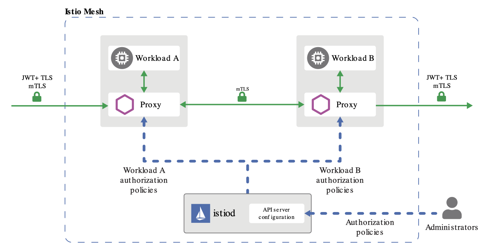
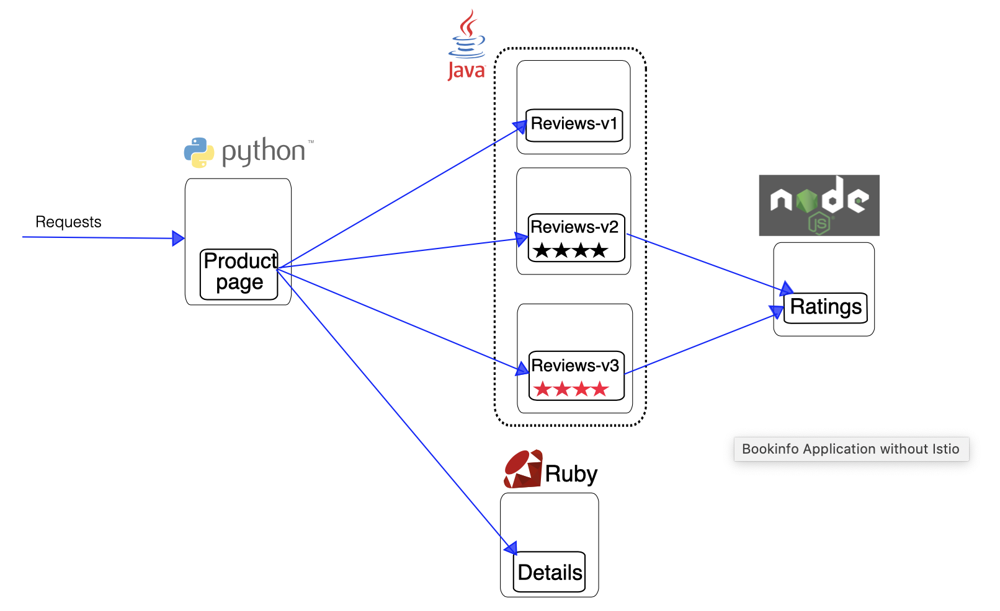
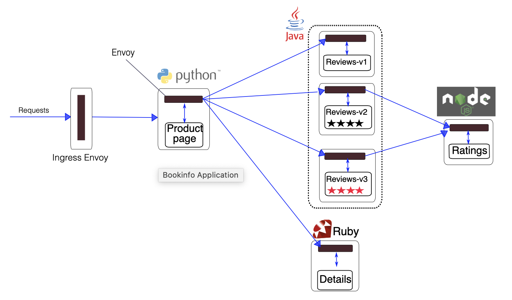
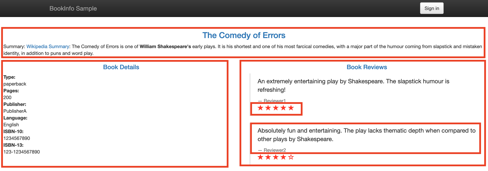
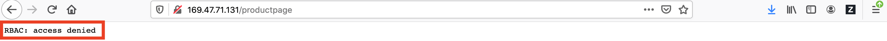
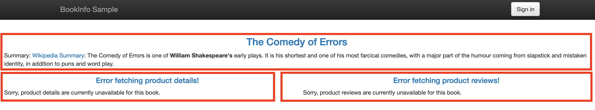
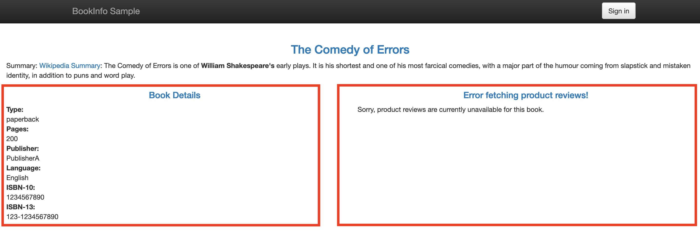

# Istio Authorization

Istio’s authorization features provide mesh-wide, namespace-wide, and workload-wide access control for your workloads in the mesh. This level of control provides the following benefits:

- Workload-to-workload and end-user-to-workload authorization.
- A Simple API: it includes a single AuthorizationPolicy CRD, which is easy to use and maintain.
- Flexible semantics: operators can define custom conditions on Istio attributes, and use DENY and ALLOW actions.
- High performance: Istio authorization is enforced natively on Envoy.
- High compatibility: supports gRPC, HTTP, HTTPS and HTTP2 natively, as well as any plain TCP protocols.

Each Envoy proxy runs an authorization engine that authorizes requests at runtime. When a request comes to the proxy, the authorization engine evaluates the request context against the current authorization policies, and returns the authorization result, either ALLOW or DENY. Operators specify Istio authorization policies using .yaml files.



You don’t need to explicitly enable Istio’s authorization features. Just apply an authorization policy to the workloads to enforce access control. For workloads without authorization policies applied, Istio doesn’t enforce access control allowing all requests.

Authorization policies support both `ALLOW` and `DENY` actions. The deny policies take precedence over allow policies. If any `allow policies` are applied to a workload, access to that workload is denied by default, unless explicitly allowed by the rule in the policy. When you apply multiple authorization policies to the same workload, Istio applies them additively.

Using Istio authorization, you can easily setup access control for workloads in your mesh. 

For the rest of repo, you first configure a simple `deny-all` authorization policy that rejects all requests to the workload, and then grant more access to the workload gradually and incrementally. While you grant additional access to the sample applicaton, you see more information on the UI. Eventually, you have all information available after granting access to all workloads.


## Requirements

- IKS 1.16 or later with 3 workers (b3c.4x16 or better)
- Add-on Istio disabled
- CLI Client: 
    * ibmcloud
    * kubectl
    * istioctl


## Lab Flow

During the lab, you are going to

- Step 1. Setup
    - 1.1 - Deploy the Sample Application
    - 1.2 - Deploy Ingress Gateway for the Application
    - 1.3 - Apply Default Destination Rules
- Step 2. Deny all Requests
    - 2.1 - "security.istio.io/v1beta1" API specification
    - 2.2 - Create Authorization Policy Denying ALL Requests
- Step 3. Grant Access to "productpage" Workload
- Step 4. Grant Access to "details-viewer" Workload
- Step 5. Grant Access to other Workloads
- Step 6. Cleanup


### Step 1. Setup

Sample application `Bookinfo` is used to explore Istio authorization in this repo. 

The application displays information about a book, similar to a single catalog entry of an online book store. Displayed on the page is a description of the book, book details (ISBN, number of pages, and so on), and a few book reviews.

The Bookinfo application is broken into four separate microservices:

- productpage - The productpage microservice calls the details and reviews microservices to populate the page.
- details - The details microservice contains book information.
- reviews - The reviews microservice contains book reviews. It also calls the ratings microservice. There are 3 versions of the reviews microservice.
- ratings - The ratings microservice contains book ranking information that accompanies a book review.



The microservices in the application are written in different languages. They have no dependencies on Istio, but make an interesting service mesh example, particularly because of the multitude of services, languages and versions for the reviews service.

> **Note: Exercise in this repo requires to install Istio on your Kubernetes cluster with the default configuration profile.**


#### 1.1 - Deploy the Sample Application

To run the sample application with Istio requires no changes to the `Bookinfo` application itself. You simply need to configure and run the services in an Istio-enabled environment, with Envoy sidecars injected along side each service. The resulting deployment will look like



All of the microservices will be packaged with an Envoy sidecar that intercepts incoming and outgoing calls for the services, providing the hooks needed to externally control, via the Istio control plane, routing, telemetry collection, and policy enforcement for the application as a whole.

To deploy the sample application `Bookinfo`,

1. Go to your 1st terminal window. You should be in folder `/tmp/intro-istio-security` or your repo download folder.

1. Enable `automatic sidecar injection` if it has not been turned on.

    ```
    $ kubectl label namespace default istio-injection=enabled
    ```

    > Note: The default Istio installation enables `automatic sidecar injection`. You can ignore the error **error: 'istio-injection' already has a value (enabled), and --overwrite is false**.

1. Deploy the application.

    ```
    $ kubectl apply -f samples/bookinfo/platform/kube/bookinfo.yaml

    service/details created
    serviceaccount/bookinfo-details created
    deployment.apps/details-v1 created
    service/ratings created
    serviceaccount/bookinfo-ratings created
    deployment.apps/ratings-v1 created
    service/reviews created
    serviceaccount/bookinfo-reviews created
    deployment.apps/reviews-v1 created
    deployment.apps/reviews-v2 created
    deployment.apps/reviews-v3 created
    service/productpage created
    serviceaccount/bookinfo-productpage created
    deployment.apps/productpage-v1 created
    ```

1. Verify all services and pods are correctly defined and running.

    ```
    kubectl get all
    ```

1. Verify that the Bookinfo application is running by sending a request from container where `ratings` is running.

    ```
    kubectl exec -it $(kubectl get pod -l app=ratings -o jsonpath='{.items[0].metadata.name}') -c ratings -- curl productpage:9080/productpage | grep -o "<title>.*</title>"

    <title>Simple Bookstore App</title>
    ```

#### 1.2 - Deploy Ingress Gateway for the Application

To simplify the testing use case and be able to easily access the sample application from a browser, An Istio Gateway is deployed.

1. You are still in the 1st terminal window. You should be in folder `/tmp/intro-istio-security` or your repo download folder.

1. Define the ingress gateway for the application.

    ```
    $ kubectl apply -f samples/bookinfo/networking/bookinfo-gateway.yaml

    gateway.networking.istio.io/bookinfo-gateway created
    virtualservice.networking.istio.io/bookinfo created
    ```

1. Verify the gateway.

    ```
    $ kubectl get gateway

    NAME               AGE
    bookinfo-gateway   99s
    ```

1. Check if your Kubernetes cluster environment supports external load balancers.

    ```
    $ kubectl get svc istio-ingressgateway -n istio-system

    NAME                   TYPE           CLUSTER-IP      EXTERNAL-IP     PORT(S)                                                                                                                                      AGE
    istio-ingressgateway   LoadBalancer   172.21.59.206   169.47.71.131   15020:31513/TCP,80:31730/TCP,443:30788/TCP,15029:31702/TCP,15030:31181/TCP,15031:30216/TCP,15032:32176/TCP,15443:31250/TCP,31400:31919/TCP   6d18h
    ```

1. If the `EXTERNAL-IP` value is set, your environment has an external load balancer that you can use for the ingress gateway. If the `EXTERNAL-IP` value is <none> (or perpetually <pending>), your environment does not provide an external load balancer for the ingress gateway. In this case, you can access the gateway using the service’s node port.

1. Set environment variable `INGRESS_HOST`.

    ```
    export INGRESS_HOST=$(kubectl -n istio-system get service istio-ingressgateway -o jsonpath='{.status.loadBalancer.ingress[0].ip}')
    ```

1. Set environment variable `INGRESS_PORT`.

    ```
    export INGRESS_PORT=$(kubectl -n istio-system get service istio-ingressgateway -o jsonpath='{.spec.ports[?(@.name=="http2")].port}')
    ```

1. Set environment variable `SECURE_INGRESS_PORT`.

    ```
    export SECURE_INGRESS_PORT=$(kubectl -n istio-system get service istio-ingressgateway -o jsonpath='{.spec.ports[?(@.name=="https")].port}')
    ```

1. Set environment variable `GATEWAY_URL`.

    ```
    $ export GATEWAY_URL=$INGRESS_HOST:$INGRESS_PORT
    ```

1. Display the IP and port# in the environment variable `GATEWAY_URL`.

    ```
    $ echo $GATEWAY_URL

    169.47.71.131:80
    ```

1. Verify that the sample application is runnign in a browser via `http://$GATEWAY_URL/productpage`. For example, http://169.47.71.131:80/productpage.

    

1. On the product page, you can see the following sections:

    - `Book title and description` on the `top`
    - `Book Details` on the lower `left` side, which includes: book type, number of pages, publisher, etc.
    - `Book Reviews` on the lower `right` of the page.
    - `Book Rating` inside the `Book Reviews` section

When you refresh the page, the app shows different versions of reviews in the product page. The app presents the reviews in a round robin style: `red` stars, `black` stars, or `no` stars.


#### 1.3 - Apply Default Destination Rules

Before you can use Istio to control the Bookinfo version routing, you need to define the available versions, called subsets, in destination rules.

1. You are still in the 1st terminal window. You should be in folder `/tmp/intro-istio-security` or your repo download folder.

1. Apply default destination rules.

    ```
    $ kubectl apply -f samples/bookinfo/networking/destination-rule-all-mtls.yaml

    destinationrule.networking.istio.io/productpage created
    destinationrule.networking.istio.io/reviews created
    destinationrule.networking.istio.io/ratings created
    destinationrule.networking.istio.io/details created
    ```

    > Note: if you installed `Istio` by taking the steps in this repo, `mutual TLS` is enabled for your IKS cluster. The configuration file `samples/bookinfo/networking/destination-rule-all-mtls.yaml` should be applied.

    > Note: if `mutual TLS` is NOT enabled in your IKS cluster for any reason, the configuration file `samples/bookinfo/networking/destination-rule-all.yaml` should be applied instead.

1. Optionally, you may verify the destination rules.

    ```
    $ kubectl get destinationrules -o yaml
    ```

1. Re-verify that the sample application is runnign in a browser via `http://$GATEWAY_URL/productpage`. For example, http://169.47.71.131:80/productpage.


### Step 2. Deny all Requests

Using Istio authorization, you can easily setup access control for workloads in your mesh. As you have verified at the end of last section, you have access to all workloads of the sample application as you have not created any authorization policy.

In this section, you configure a simple deny-all policy that rejects all requests to the workloads in the application.

Below is a `deny-all` authorization policy for the default namespace. The policy doesn’t have a `selector` field, which applies the policy to every workload in the default namespace. So, it covers all worekloads in the mesh. The `spec:` field of the policy has the empty value {}. Because no rule is set, the match will never occur. That value means that no traffic is permitted, effectively denying all requests.

```
apiVersion: security.istio.io/v1beta1
kind: AuthorizationPolicy
metadata:
  name: deny-all
  namespace: default
spec:
  {}
```

#### 2.1 - "security.istio.io/v1beta1" API specification

Istio Authorization Policy enables access control on workloads in the mesh.

Authorization policy supports both `allow` and `deny` policies. When allow and deny policies are used for a workload at the same time, the deny policies are evaluated first. The evaluation is determined by the following rules:

1. If there are any DENY policies that match the request, deny the request.
1. If there are no ALLOW policies for the workload, allow the request.
1. If any of the ALLOW policies match the request, allow the request.
1. Deny the request.

Authorization Policy scope (target) is determined by “metadata/namespace” and an optional “selector”.

- “metadata/namespace” tells which namespace the policy applies. If set to root namespace, the policy applies to all namespaces in a mesh.
- workload “selector” can be used to further restrict where a policy applies.

`selector:` field in the `spec:` section is optional. Workload `selector` decides where to apply the authorization policy. If not set, the authorization policy will be applied to all workloads in the same namespace as the authorization policy.

`rules:` field in the `spec:` section is optional. It defined a list of rules to match the request. A match occurs when at least one rule matches the request. If not set, the match will never occur. **This is equivalent to setting a default of deny for the target workloads**.

`action:` field can be set to either `ALLOW` or `DENY`. The default action is `ALLOW`. 

[Detail information](https://istio.io/docs/reference/config/security/authorization-policy/) on `security.istio.io/v1beta1` API specification.


#### 2.2 - Create Authorization Policy Denying ALL Requests

To create the `deny-all` authorization policy,

1. You are still in the 1st terminal window. You should be in folder `/tmp/intro-istio-security` or your repo download folder.

1. Create a `deny-all` authorization policy.

    ```
    $ scripts/deny-all-authorization-policy.sh

    -----Create an Authorization Policy to Deny All Requests-----
    authorizationpolicy.security.istio.io/deny-all created
    ```

1. Verify the new `authorization policy` was created.

    ```
    $ kubectl get authorizationpolicy --all-namespaces

    NAMESPACE   NAME       AGE
    default     deny-all   2m9s
    ```

1. Visit the Bookinfo productpage (http://$GATEWAY_URL/productpage) in a browser. You should see `RBAC: access denied`. 

    

    The `deny-all` authorization policy is in effective. Istio doesn’t have any rules that allow any access to workloads in the mesh.


### Step 3. Grant Access to "productpage" Workload

The following configuration creates a productpage-viewer policy to allow access with `GET` method to the `productpage` workload. The policy does not set the `from` field in the `rules` which means all sources are allowed, effectively allowing all users and workloads.

```
apiVersion: "security.istio.io/v1beta1"
kind: "AuthorizationPolicy"
metadata:
  name: "productpage-viewer"
  namespace: default
spec:
  selector:
    matchLabels:
      app: productpage
  action: ALLOW
  rules:
  - to:
    - operation:
        methods: ["GET"]
```

> Note: `action: ALLOW` is optional. The default action is `ALLOW`.

To create the `productpage-viewer` authorization policy,

1. You are still in the 1st terminal window. You should be in folder `/tmp/intro-istio-security` or your repo download folder.

1. Create a `productpage-viewer` authorization policy.

    ```
    $ scripts/productpage-viewer-authorization-policy.sh

    -----Create an Authorization Policy to Allow 'productpage-viewer'-----
    authorizationpolicy.security.istio.io/productpage-viewer created
    ```

1. Verify the new `authorization policy` was created.

    ```
    $ kubectl get authorizationpolicy --all-namespaces

    NAMESPACE   NAME                 AGE
    default     deny-all             95m
    default     productpage-viewer   28s
    ```

1. Visit the Bookinfo productpage (http://$GATEWAY_URL/productpage) in a browser. Now you should see the “Bookinfo Sample” page. However, you can see the following errors on the page:
    - Error fetching product details
    - Error fetching product reviews on the page.

    

    These errors are expected because we have not granted the productpage workload access to the details and reviews workloads. Next, you need to configure a policy to grant access to those workloads.


### Step 4. Grant Access to "details-viewer" Workload

The following configuration creates the `details-viewer` policy to allow the `productpage` workload, which issues requests using the `cluster.local/ns/default/sa/bookinfo-productpage` service account, to access the `details` workload through `GET` methods.

```
apiVersion: "security.istio.io/v1beta1"
kind: "AuthorizationPolicy"
metadata:
  name: "details-viewer"
  namespace: default
spec:
  selector:
    matchLabels:
      app: details
  rules:
  - from:
    - source:
        principals: ["cluster.local/ns/default/sa/bookinfo-productpage"]
    to:
    - operation:
        methods: ["GET"]
```

To create the `details-viewer` authorization policy,

1. You are still in the 1st terminal window. You should be in folder `/tmp/intro-istio-security` or your repo download folder.

1. Create a `productpage-viewer` authorization policy.

    ```
    $ scripts/details-viewer-authorization-policy.sh

    -----Create an Authorization Policy to Allow 'details-viewer'-----
    authorizationpolicy.security.istio.io/details-viewer created
    ```

1. Verify the new `authorization policy` was created.

    ```
    $ kubectl get authorizationpolicy --all-namespaces

    NAMESPACE   NAME                 AGE
    default     deny-all             118m
    default     details-viewer       49s
    default     productpage-viewer   2m45s
    ```

1. Visit the Bookinfo productpage (http://$GATEWAY_URL/productpage) in a browser. Now, section `product details` became available after you granted access. However, you still have the following errors on the page:
    - Error fetching product reviews on the page.

    

    These errors are expected because you have not granted access to all workloads. Next, you need to configure a policy to grant access to those workloads.


### Step 5. Grant Access to other Workloads

The following configuration creates a policy `reviews-viewer` to allow the `productpage` workload, which issues requests using the `cluster.local/ns/default/sa/bookinfo-productpage` service account, to access the `reviews` workload through `GET` methods.

```
apiVersion: "security.istio.io/v1beta1"
kind: "AuthorizationPolicy"
metadata:
  name: "reviews-viewer"
  namespace: default
spec:
  selector:
    matchLabels:
      app: reviews
  rules:
  - from:
    - source:
        principals: ["cluster.local/ns/default/sa/bookinfo-productpage"]
    to:
    - operation:
        methods: ["GET"]
```

The following configuration creates the `ratings-viewer` policy to allow the `reviews` workload, which issues requests using the `cluster.local/ns/default/sa/bookinfo-reviews` service account, to access the `ratings` workload through `GET` methods

```
apiVersion: "security.istio.io/v1beta1"
kind: "AuthorizationPolicy"
metadata:
  name: "ratings-viewer"
  namespace: default
spec:
  selector:
    matchLabels:
      app: ratings
  rules:
  - from:
    - source:
        principals: ["cluster.local/ns/default/sa/bookinfo-reviews"]
    to:
    - operation:
        methods: ["GET"]
```

To grant access to the rest of workloads,

1. You are still in the 1st terminal window. You should be in folder `/tmp/intro-istio-security` or your repo download folder.

1. Create a `reviews-viewer` authorization policy.

    ```
    $ scripts/reviews-viewer-authorization-policy.sh

    -----Create an Authorization Policy to Allow 'reviews-viewer'-----
    authorizationpolicy.security.istio.io/reviews-viewer created
    ```

1. Create a `ratings-viewer` authorization policy.

    ```
    $ scripts/ratings-viewer-authorization-policy.sh

    -----Create an Authorization Policy to Allow 'ratings-viewer'-----
    authorizationpolicy.security.istio.io/ratings-viewer created
    ```

1. Verify the all `authorization policies` were created.

    ```
    $ kubectl get authorizationpolicy --all-namespaces

    NAMESPACE   NAME                 AGE
    default     deny-all             147m
    default     details-viewer       29m
    default     productpage-viewer   31m
    default     ratings-viewer       34s
    default     reviews-viewer       3m21s
    ```

1. Visit the Bookinfo productpage (http://$GATEWAY_URL/productpage) in a browser. You should see all information. When you refresh the page, you should see either “black” ratings, “red” ratings or "no" ratings in the “Book Reviews” section.

    


### Step 6. Cleanup

When you’re finished experimenting with the Bookinfo sample, uninstall and clean it up using the following instructions.

1. You are still in the 1st terminal window. You should be in folder `/tmp/intro-istio-security` or your repo download folder.

1. Delete the routing rules and terminate the application pods.

    ```
    $ samples/bookinfo/platform/kube/cleanup.sh
    ```

1. Confirm shutdown.

    ```
    $ kubectl get virtualservices   #-- there should be no virtual services
    $ kubectl get destinationrules  #-- there should be no destination rules
    $ kubectl get gateway           #-- there should be no gateway
    $ kubectl get pods              #-- the Bookinfo pods should be deleted
    ```


## Related Links

- [Open Cybersecurity Alliance](https://opencybersecurityalliance.org/)
- [Istio Concepts - Security](https://istio.io/docs/concepts/security/)
- [Istio Tasks - Security](https://istio.io/docs/tasks/security/)
