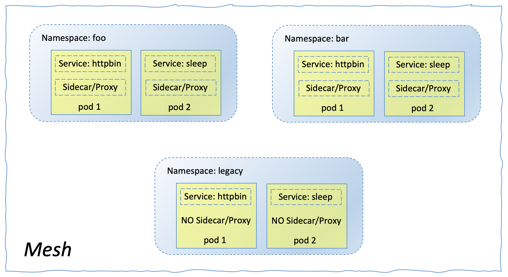

# Istio Peer Authentication

Peer Authentication is used for communications between services within the same service mesh.

Peer authentication policies specify the mutual TLS mode that Istio enforces on target workloads. The following modes are supported:

- **PERMISSIVE**: Workloads accept both mutual TLS and plain text traffic. This mode is most useful during migrations when workloads without sidecar cannot use mutual TLS. Once workloads are migrated with sidecar injection, you should switch the mode to STRICT.
- **STRICT**: Workloads only accept mutual TLS traffic.
- **DISABLE**: Mutual TLS is disabled. From a security perspective, you shouldn’t use this mode unless you provide your own security solution.

When the mode is unset, the mode of the parent scope is inherited. Mesh-wide peer authentication policies with an unset mode use the PERMISSIVE mode by default.

Since service-to-service communication does not typically involve human being, you'll use simulation methods to simulate the service-to-service communication for peer authentication related activities. The first couple of sections in this part of exercise help you understand the simulation methods.


## Requirements

- IKS 1.16 or later with 3 workers (b3c.4x16 or better)
- Add-on Istio disabled
- CLI Client: 
    * ibmcloud
    * kubectl
    * istioctl


## Lab Flow

During the lab, you are going to

- Step 1. Setup
- Step 2. Make Service-to-Service Calls in Container
    - 2.1 - Review "docker container exec" Command
    - 2.2 - Review "kubectl exec" Command
- Step 3. Is Data-in-Motion Secured? - Network Traffic Monitoring
- Step 4. Make Service Call to Workload "httpbin"
- Step 5. Auto Mutual TLS
- Step 6. Is Data-in-Motion Secured?
    - 6.1 - Send Service Requests from "sleep.legacy" to "httpbin.foo"
    - 6.2 - Send Service Requests from "sleep.bar" to "httpbin.foo"
- Step 7. Better Method to Identify Mutual TLS
- Step 8. Peer Authentication without Policy
- Step 9. Enabe Mesh-Wide Istio Mutual TLS
- Step 10. Enable Mutual TLS for a Namespace
- Step 11. Enable Mutual TLS for a Workload
- Step 12. Enable Mutual TLS for a Port
- Step 13. Peer Authentication Policy Precedence
- Step 14. Cleanup
- Step 15. Peer Authentication Summary


### Step 1. Setup

As the Peer Authentication covers the communication between services within a service mesh, two microservices or workloads (both terms refer to the microservice that is deployed into the service mesh in this repo) will be deployed to three namespaces in your IKS cluster. 
- `httpbin`
- `sleep`

In namespace `foo` and `bar`, service `httpbin` and its `Istio Sidecar/Envoy proxy` run in seperate containers of pod 1. Similarly, service `sleep` and its `Istio Sidecar/Envoy proxy` run in seperate containers of pod 2.

In namespace `legacy`, service `httpbin` runs in a container of pod 1 without `Istio Sidecar/Envoy proxy`. Service `sleep` runs in a container of pod 2 without `Istio Sidecar/Envoy proxy`.



1. Go the 2nd terminal window. You should be in folder `/tmp/intro-istio-security` or your repo download folder.

1. Execute

    ```
    $ scripts/peer-auth-setup.sh
    ```
    The lab environment in the above diagram was created.


### Step 2. Make Service-to-Service Calls in Container

Now, you have both service `httpbin` and `sleep` containers running in three namespaces within the service mesh. To simulate the service-to-service communications within the mesh, you can make service call to `httpbin` workload in one of the three namespaces, from the `sleep` container running in either the same namespace or different one.

To be able to make service call from `sleep` workload, you need to get into the container in your IKS cluster where service `sleep` is deployed and running. 

That's what command `docker container exec` and `kubectl exec` are for.

#### 2.1 - Review "docker container exec" Command

You can execute command within a container running locally,

1. Open a new terminla window.

1. Start a local docker container

    ```
    $ docker container run -t ubuntu top
    ```

    The command starts a container with the `ubuntu` image using the `top` command. The -t flags allocates a pseudo-TTY which is needed for the `top` commandto work correctly. `top` command keeps the container alive.

1. Go to your 2nd terminal window. You should be in folder `/tmp/intro-istio-security` or your repo download folder.

1. Retrieve the running container ID.

    ```
    $ docker container ls

    CONTAINER ID        IMAGE               COMMAND             CREATED             STATUS              PORTS               NAMES
    50411b2b0116        ubuntu              "top"               4 minutes ago       Up 4 minutes                            gracious_wiles
    ```

1. Evaluate running processes in the container.

    ```
    $ docker container exec -it 50411b2b0116 ps -ef

    UID        PID  PPID  C STIME TTY          TIME CMD
    root         1     0  0 01:50 pts/0    00:00:00 top
    root        30     0  0 02:08 pts/1    00:00:00 ps -ef
    ```

    > Note, you must replace container ID `50411b2b0116` with your container ID retrieved by `docker container ls` command.

    Command `docker container exec -it 50411b2b0116` allows you to get into your container. Command `ps -ef` is the action that you took within your container. In this case, you retrieved the running processes in the container.

1. Go back to your new terminal window and CTL-C to stop the running local container.

#### 2.2 - Review "kubectl exec" Command 

You can execute command within a container running in your IKS cluster. To do so, you need both pod ID and container name where a service is running.

1. Go the 2nd terminal window. You should be in folder `/tmp/intro-istio-security` or your repo download folder.

1. Retrieve pod ID of pod 1 where service `httpbin` is running in namespace `foo`.

    ```
    $ export httpbin_in_foo=`kubectl get pod -nfoo -lapp=httpbin -ojsonpath={.items..metadata.name}`

    $ echo $httpbin_in_foo

    httpbin-7f58565dc-7kr42
    ```

1. Evaluate running processes in the container hosting sidecar of the same pod (service `istio-proxy`) within namespace `foo`.

    ```
    $ kubectl exec -nfoo $httpbin_in_foo -c istio-proxy -it -- ps -ef

    UID         PID   PPID  C STIME TTY          TIME CMD
    istio-p+      1      0  0 May07 ?        00:00:09 /usr/local/bin/pilot-agent pro
    istio-p+     20      1  0 May07 ?        00:00:46 /usr/local/bin/envoy -c /etc/i
    istio-p+     33      0  0 02:38 pts/0    00:00:00 ps -ef
    ```

    Command `kubectl exec -nfoo $httpbin_in_foo -c istio-proxy -it` allows you to get into your container hosting the sidecar of the same pod (pod 1) where service `httpbin` is running within namespace `foo`. Command `ps -ef` is the action that you took within the container. In this case, you retrieved the running processes in the container.

    

1. Combine the above two commands, you can get the same result by running one command which executes `ps -ef` command in that container.

    ```
    $ kubectl exec -nfoo $(kubectl get pod -nfoo -lapp=httpbin -ojsonpath={.items..metadata.name}) -c istio-proxy -it -- ps -ef
    ```


### Step 3. Is Data-in-Motion Secured? - Network Traffic Monitoring

Running command `ps -ef` in sidecar container of pod 1 of namespace `foo` can be helpful. However, running command `tcpdump` (instead of `ps -ef`) can be much more useful. It allows you to monitor network traffic of the pod where the sidecar container is running.

1. You are still in the 2nd terminal window. You should be in folder `/tmp/intro-istio-security` or your repo download folder.

1. Monitor network traffic of pod 1 in the namespace `foo`.

    ```
    $ kubectl exec -nfoo $(kubectl get pod -nfoo -lapp=httpbin -ojsonpath={.items..metadata.name}) -c istio-proxy -it -- sudo tcpdump dst port 80 -A

    tcpdump: verbose output suppressed, use -v or -vv for full protocol decode
    listening on eth0, link-type EN10MB (Ethernet), capture size 262144 bytes
    ```

    Command `tcpdump` dumps the TCP traffic occuring at a server. In this case, it's the sidecar container of the pod 1 where service `httpbin` is running in namespace `foo`. Because a sidecar takes over the network communications of the pod, `tcpdump` dump of the sidecar essentially reflects the network traffic of the entire pod.

    So, command `tcpdump dst port 80 -A` running in this sidecar container is monitoring the netwrok traffic of the pod 1 in the namespace `foo`. Now, if you can make service call to the `httpbin` service in namespace `foo`, you can verify if the network traffic is encrypted or not. In another word, you can verify if you have secured data-in-motion for network traffic between services within the service mesh.

    

1. You started monitoring network traffic of pod 1 in the namespace `foo`. You can go back to the 2nd terminal window anytime to check the network traffic information.


### Step 4. Make Service Call to Workload "httpbin"

You can use the same method to get access to other containers running in your IKS cluster, and then make call to the workload `httpbin` in the namespace `foo`. 

For the rest of repo, the workload `httpbin` in the namespace `foo` is referred as `httpbin.foo`.

1. Go to the 1st terminal window as the 2nd one is busy now. You should be in folder `/tmp/intro-istio-security` or your repo download folder.

1. Make service call from `sleep.legacy` to `httpbin.foo`.

    ```
    $ kubectl exec $(kubectl get pod -l app=sleep -n legacy -o jsonpath={.items..metadata.name}) -c sleep -n legacy -- curl http://httpbin.foo:8000/ip -s -o /dev/null -w "%{http_code}\n"

    200
    ```

    As explained in the previous sections, `$(kubectl get pod -l app=sleep -n legacy -o jsonpath={.items..metadata.name})` retrieve pod ID where sleep.legacy is running.

    `kubectl exec $(kubectl get pod -l app=sleep -n legacy -o jsonpath={.items..metadata.name}) -c sleep -n legacy` allows you to execute commands within the container just like you have login to the container. `-c sleep` specifies the container name and `-n legacy` specifies the namespace.

    `curl http://httpbin.foo:8000/ip -s -o /dev/null -w "%{http_code}\n"` is the command that is issued within the container. The command calls the `httpbin.foo` service by issuing curl command and return the http response code.


### Step 5. Auto Mutual TLS

Istio v1.4 or later offers **auto mutual TLS** feature. You can adopt mutual TLS by only configuring authentication policy without worrying about destination rule. This allows you to adopt Istio mutual TLS incrementally with minimal manual configuration.

Istio tracks the server workloads that have Istio sidecar, and configures client sidecar to send `mutual TLS traffic` (encrypted traffic) to those server workloads automatically, and send `plain text traffic` to server workloads without sidecars.

1. You are still in the 1st terminal window. You should be in folder `/tmp/intro-istio-security` or your repo download folder.

1. The `default` profile enables **auto mutual TLS** feature. You can verify `enableAutoMtls` setting with the command below.

    ```
    $ istioctl manifest generate --set profile=default | grep "enableAutoMtls"

    enableAutoMtls: true
    ```


### Step 6. Is Data-in-Motion Secured?

Up to this point, you have started network traffic monitoring of `httpbin.foo` service and have a way to send requests to the service httpbin.foo from another workload within the IKS cluster. 

You are ready to verify if the network traffic between services within your IKS cluster is encrypted or secured. Because of the **auto mutual TLS** feature, it's possible to encrypt network traffic without defining any peer authentication policy.

#### 6.1 - Send Service Requests from "sleep.legacy" to "httpbin.foo"

Istio sidecar was not installed in the namespace `legacy` when you deployed workload `sleep` and `httpbin` in the lab environment. 

When you send service requests from `sleep.legacy` (workload `sleep` in the namespace `legacy`) to `httpbin.foo` (workload `httpbin` in namespace `foo`), the service request should be sent in `plain texts format` because `sleep.legacy` does not have a sidecar and **auto mutual TLS** feature is enabled for the lab environment as you have verified in the previous section.

1. You are still in the 1st terminal window. You should be in folder `/tmp/intro-istio-security` or your repo download folder.

1. Sent service requests from `sleep.legacy` to `httpbin.foo`.

    ```
    $ kubectl exec $(kubectl get pod -l app=sleep -n legacy -o jsonpath={.items..metadata.name}) -c sleep -n legacy -- curl http://httpbin.foo:8000/ip -s -o /dev/null -w "%{http_code}\n"

    200
    ```

1. Go to the 2nd terminal window and observe the network traffic caused by the previous command. 

    ```
    23:08:10.738542 IP 172-30-85-248.sleep.legacy.svc.cluster.local.50142 > httpbin-7f58565dc-7kr42.80: Flags [.], ack 1043857359, win 128, options [nop,nop,TS val 3229339027 ecr 1172808967], length 0
    E..4.q@.>.....U....<...PN...>7.............
    .{..E...
    23:08:10.738773 IP 172-30-85-248.sleep.legacy.svc.cluster.local.50142 > httpbin-7f58565dc-7kr42.80: Flags [P.], seq 0:82, ack 1, win 128, options [nop,nop,TS val 3229339027 ecr 1172808967], length 82: HTTP: GET /ip HTTP/1.1
    E....r@.>.....U....<...PN...>7......|......
    .{..E...GET /ip HTTP/1.1
    Host: httpbin.foo:8000
    User-Agent: curl/7.64.0
    Accept: */*
    ```

    **IP 172-30-85-248.sleep.legacy.svc.cluster.local.50142 > httpbin-7f58565dc-7kr42.80** shows that the network traffic were from `IP 172-30-85-248.sleep.legacy.svc.cluster.local.50142` to `httpbin-7f58565dc-7kr42.80`.

    **length 82: HTTP: GET /ip HTTP/1.1**, **Host: httpbin.foo:8000** and **User-Agent: curl/7.64.0** show the detail information of the workload request.

1. You have verifed that the network traffic payload between workload `sleep.legacy` and workload `httpbin.foo` was in `plain text` format. 

    `Data-in-motion` is not enabled in this use case because `sleep.legacy` does not have a Istio sidecar. Istio tracks all these information. When a service request goes out from `sleep.legacy`, it's sent as `plain text` payload. The same is true for the reply payload from `httpbin.foo`.

#### 6.2 - Send Service Requests from "sleep.bar" to "httpbin.foo"

Istio sidecar was deployed in the namespace `bar` when you deployed workload `sleep` and `httpbin` in the lab environment. 

When you send service requests from `sleep.bar` (workload `sleep` in the namespace `bar`) to `httpbin.foo` (workload `httpbin` in namespace `foo`), the service request should be sent in `encrypted format` because `sleep.bar` does have a sidecar and **auto mutual TLS** feature is enabled for the lab environment as you have verified in the previous section.

1. Go to the 1st terminal window. You should be in folder `/tmp/intro-istio-security` or your repo download folder.

1. Sent service requests from `sleep.bar` to `httpbin.foo`.

    ```
    $ kubectl exec $(kubectl get pod -l app=sleep -n bar -o jsonpath={.items..metadata.name}) -c sleep -n bar -- curl http://httpbin.foo:8000/ip -s -o /dev/null -w "%{http_code}\n"

    200
    ```

1. Go to the 2nd terminal window and observe the network traffic caused by the previous command. 

1. You can still find the source and destination of the network traffic. **IP 172-30-93-35.sleep.bar.svc.cluster.local.51592 > httpbin-7f58565dc-7kr42.80** shows that the network traffic were from `IIP 172-30-93-35.sleep.bar.svc.cluster.local.51592` to `httpbin-7f58565dc-7kr42.80`.

1. However, the detail information of the service request itself can't be found in the traffic payload. When you made the similar service request from `sleep.legacy` container, the detail information of the service request was found in the traffic payload as below.

    ```
    .{..E...GET /ip HTTP/1.1
    Host: httpbin.foo:8000
    User-Agent: curl/7.64.0
    Accept: */*
    ```

1. You have verifed that the communication payload between workload `sleep.bar` and workload `httpbin.foo` was in `encypted` format. In other word, `Istio mutual TLS` helps you accomplish `data-in-motion` security without any change to your application.

    `Data-in-motion` is accomplished in this use case because `sleep.bar` does have a Istio sidecar. Istio tracks all these information. When a service request goes out from `sleep.bar`, it's sent as `encypted` payload. The same is true for the reply payload from `httpbin.foo`.


### Step 7. Better Method to Identify Mutual TLS

It's great that you have a way to check if mutual TLS is effective and if the network traffic payload is encypted. However, the method requires to review `tcpdump` dumps. Not quite comvenient and tuitive. 

In this section, you are going to identify a better way.

1. You are still in the 1st terminal window. You should be in folder `/tmp/intro-istio-security` or your repo download folder.

1. Make a service call to `httpbin.foo` workload from `sleep.legacy`. Based on the conclusion from the previous section, the payload of network traffic between `httpbin.foo` and `sleep.legacy` are in `plain text`.

    ```
    $ kubectl exec $(kubectl get pod -l app=sleep -n legacy -o jsonpath={.items..metadata.name}) -c sleep -n legacy -- curl http://httpbin.foo:8000/headers  -s  -w "response code: %{http_code}\n"
    ```

1. The command returns

    ```
    {
      "headers": {
        "Accept": "*/*", 
        "Content-Length": "0", 
        "Host": "httpbin.foo:8000", 
        "User-Agent": "curl/7.64.0", 
        "X-B3-Sampled": "0", 
        "X-B3-Spanid": "2538408a97212eb2", 
        "X-B3-Traceid": "b49dabfa9447b62a2538408a97212eb2"
      }
    }
    response code: 200
    ```

1. Make a service call to `httpbin.foo` workload from `sleep.bar`. Based on the conclusion from the previous section, the payload of network traffic between `httpbin.foo` and `sleep.bar` are `encrypted`.

    ```
    $ kubectl exec $(kubectl get pod -l app=sleep -n bar -o jsonpath={.items..metadata.name}) -c sleep -n bar -- curl http://httpbin.foo:8000/headers  -s  -w "response code: %{http_code}\n"
    ```

1. The command returns

    ```
    {
      "headers": {
        "Accept": "*/*", 
        "Content-Length": "0", 
        "Host": "httpbin.foo:8000", 
        "User-Agent": "curl/7.64.0", 
        "X-B3-Parentspanid": "a8ff76317b935ab9", 
        "X-B3-Sampled": "0", 
        "X-B3-Spanid": "3c2a16993c2964a6", 
        "X-B3-Traceid": "ab62e2c5018b67f0a8ff76317b935ab9", 
        "X-Forwarded-Client-Cert": "By=spiffe://cluster.local/ns/foo/sa/httpbin;Hash=434b9f09db06f82a9f612ce1a056dfae8c9ba4da72936b100c54c3bb240abc07;Subject=\"\";URI=spiffe://cluster.local/ns/bar/sa/sleep"
      }
    }
    response code: 200
    ```

1. Compare the return of the last two commands, the only difference is that the header of the request from `sleep.var` to `httpbin.foo` has additional component as shown below.

    ```
        "X-Forwarded-Client-Cert": "By=spiffe://cluster.local/ns/foo/sa/httpbin;Hash=434b9f09db06f82a9f612ce1a056dfae8c9ba4da72936b100c54c3bb240abc07;Subject=\"\";URI=spiffe://cluster.local/ns/bar/sa/sleep"
    ```

1. When using mutual TLS, the sidecar/proxy injects the `X-Forwarded-Client-Cert` header to the upstream request to the backend. That header’s presence is evidence that mutual TLS is used. 

1. With this discovery, now you can easily identify if mutual TLS is used (same as if the traffic payload is encrypted) for a service-to-service communication. You only have to modify the last two commands slightly to check if the request header contains `X-Forwarded-Client-Cert` component.

1. Make a service call to `httpbin.foo` workload from `sleep.legacy`. 

    ```
    $ kubectl exec $(kubectl get pod -l app=sleep -n legacy -o jsonpath={.items..metadata.name}) -c sleep -n legacy -- curl http://httpbin.foo:8000/headers  -s  -w "response code: %{http_code}\n" | egrep -o 'X-Forwarded-Client-Cert*|response.*$'

    response code: 200
    ```

    The request header does not contain `X-Forwarded-Client-Cert` component. The network traffic payload is in `plain text`. This is consistent with what you already knew.

1. Make a service call to `httpbin.foo` workload from `sleep.bar`.

    ```
    $ kubectl exec $(kubectl get pod -l app=sleep -n bar -o jsonpath={.items..metadata.name}) -c sleep -n bar -- curl http://httpbin.foo:8000/headers  -s  -w "response code: %{http_code}\n" | egrep -o 'X-Forwarded-Client-Cert*|response.*$'

    X-Forwarded-Client-Cert
    response code: 200
    ```

    The request header does contain `X-Forwarded-Client-Cert` component. The network traffic payload is `encrypted`. This is also consistent with what you already knew.

1. Congratulation. You have a better and easy way to identify if `mutual TLS` is used, if the network traffic payload is `encrypted` without monitring network traffic.


### Step 8. Peer Authentication without Policy

You have deployed two microservices/workloads to three namespaces in your IKS cluster. 
- `httpbin`
- `sleep`

In namespace `foo` and `bar`, service `httpbin` and its `Istio Sidecar/Envoy proxy` run in seperate containers of pod 1. Similarly, service `sleep` and its `Istio Sidecar/Envoy proxy` run in seperate containers of pod 2.

In namespace `legacy`, service `httpbin` runs in a container of pod 1 without `Istio Sidecar/Envoy proxy`. Service `sleep` runs in a container of pod 2 without `Istio Sidecar/Envoy proxy`.


For the rest of peer authentication discussion, you are going to make configuration changes and observe how the changes effect to the mutual TLS. 

Before making any change, observe the default `peer authetication`.

1. You are still in the 1st terminal window. You should be in folder `/tmp/intro-istio-security` or your repo download folder.

1. Check the communications between `sleep` workload and `httpbin` workload for all namespaces and their current effective `mutual TLS`.

    ```
    $ scripts/sleep-to-httpbin-test.sh

    -----
    X-Forwarded-Client-Cert
    TEST: sleep.foo to httpbin.foo: 200
    -----
    X-Forwarded-Client-Cert
    TEST: sleep.foo to httpbin.bar: 200
    -----
    TEST: sleep.foo to httpbin.legacy: 200
    -----
    X-Forwarded-Client-Cert
    TEST: sleep.bar to httpbin.foo: 200
    -----
    X-Forwarded-Client-Cert
    TEST: sleep.bar to httpbin.bar: 200
    -----
    TEST: sleep.bar to httpbin.legacy: 200
    -----
    TEST: sleep.legacy to httpbin.foo: 200
    -----
    TEST: sleep.legacy to httpbin.bar: 200
    -----
    TEST: sleep.legacy to httpbin.legacy: 200
    -----
    ```

1. Return code `200` shows that all communications between `sleep` workload and `httpbin` workload are permitted at the moment.

1. `X-Forwarded-Client-Cert` indicates that the communications between `sleep` workload and `httpbin` workload are encrypted and secured (`mutual TLS` is in effective). At the momeent, the following communications are secured.

    - sleep.foo to httpbin.foo
    - sleep.foo to httpbin.bar
    - sleep.bar to httpbin.foo
    - sleep.bar to httpbin.bar

    The communications between other workloads are not encrypted or unsecured.


### Step 9. Enabe Mesh-Wide Istio Mutual TLS

You have learned how `Auto mutual TLS` works in the previous section. It's a great feature that can help onboarding Istio as both secured and unsecured communications are permitted with the IKS cluster. 

To prevent non-mutual TLS for the whole mesh, you can set a `mesh-wide peer authentication policy` to set mutual TLS mode to `STRICT`. The mesh-wide peer authentication policy shouldn’t have a selector section, and it must apply to the root namespace. The default namespace `istio-system` is used below.

```
apiVersion: "security.istio.io/v1beta1"
kind: "PeerAuthentication"
metadata:
  name: "default"
  namespace: "istio-system"
spec:
  mtls:
    mode: STRICT
```

This peer authentication policy has the following effects: - It configures all workloads in the mesh to only accept requests encrypted with TLS. Since it doesn’t specify a value for the selector field, the policy applies to all workloads in the mesh.

1. You are still in the 1st terminal window. You should be in folder `/tmp/intro-istio-security` or your repo download folder.

1. Create a mesh-wide peer authentication policy.

    ```
    $ scripts/mesh-peer-auth-policy.sh

    -----Create Mesh-Wide Peer Authentication Policy-----
    peerauthentication.security.istio.io/default created
    ```

1. Verify new peer authentication policy.

    ```
    $ kubectl get peerauthentication --all-namespaces

    NAMESPACE      NAME      AGE
    istio-system   default   117s
    ```

1. Check the impact of the new mess-wide peer authentication policy on the communications between `sleep` workload and `httpbin` workload for all namespaces.

    ```
    $ scripts/sleep-to-httpbin-test.sh

    -----
    X-Forwarded-Client-Cert
    TEST: sleep.foo to httpbin.foo: 200
    -----
    X-Forwarded-Client-Cert
    TEST: sleep.foo to httpbin.bar: 200
    -----
    TEST: sleep.foo to httpbin.legacy: 200
    -----
    X-Forwarded-Client-Cert
    TEST: sleep.bar to httpbin.foo: 200
    -----
    X-Forwarded-Client-Cert
    TEST: sleep.bar to httpbin.bar: 200
    -----
    TEST: sleep.bar to httpbin.legacy: 200
    -----
    TEST: sleep.legacy to httpbin.foo: 000
    command terminated with exit code 56
    -----
    TEST: sleep.legacy to httpbin.bar: 000
    command terminated with exit code 56
    -----
    TEST: sleep.legacy to httpbin.legacy: 200
    -----
    ```

1. The only difference is that the communication failed for the requests from the client without proxy - `sleep.legacy`, to the workload with a proxy - `httpbin.foo` or `httpbin.bar`. This is expected as the mutual TLS is now strictly enforced by Istio. The workload without sidecar can not comply.

1. The communication to `httpbin.legacy` is still working because the workload does not have `Istio sidecar`. No matter the requests are from clients with sidecar - `httpbin.foo` or `httpbin.bar`, or from client without sidecar - `sleep.legacy`. When the server workload (the one receives service request) does not have `Istio sidecar`, the service request goes straight to the workload itself. So, no Istio policy is in effective for the workload. 

1. When a service request comes from a workload with Itsio sidecar(`httpbin.foo` or `httpbin.bar`) and goes to a workload without sidecar(`sleep.legacy`), Istio knows about it because Istio tracks the information. Istio sends the request in `plain text` to the destination. The above result of `httpbin.foo` request to `sleep.legacy` and `httpbin.bar` request to `sleep.legacy` verify it. It only has return code 200. `X-Forwarded-Client-Cert` is not added to header.

1. Remove global authentication policy.

    ```
    $ kubectl delete peerauthentication -n istio-system default

    peerauthentication.security.istio.io "default" deleted
    ```


### Step 10. Enable Mutual TLS for a Namespace

To change `mutual TLS` for all workloads within a particular namespace, use a `namespace-wide policy`. The specification of the policy is the same as for a mesh-wide policy, but you specify the namespace it applies to under metadata. For example, the following peer authentication policy enables strict mutual TLS for the `foo` namespace.

```
apiVersion: "security.istio.io/v1beta1"
kind: "PeerAuthentication"
metadata:
  name: "namespace-wide-policy"
  namespace: "foo"
spec:
  mtls:
    mode: STRICT
```

This peer authentication policy configures all workloads in the namespace `foo` to only accept requests encrypted with TLS. Since it doesn’t specify a value for the selector field, the policy applies to all workloads in the namespace.

1. You are still in the 1st terminal window. You should be in folder `/tmp/intro-istio-security` or your repo download folder.

1. Create a namespace-wide peer authentication policy.

    ```
    $ scripts/namespace-peer-auth-policy.sh

    -----Create Namespace-Wide Peer Authentication Policy-----
    peerauthentication.security.istio.io/namespace-wide-policy created
    ```

1. Verify new peer authentication policy.

    ```
    $ kubectl get peerauthentication --all-namespaces

    NAMESPACE   NAME                    AGE
    foo         namespace-wide-policy   44s
    ```

1. Check the impact of the new namespace-wide peer authentication policy on the communications between `sleep` workload and `httpbin` workload for all namespaces.

    ```
    $ scripts/sleep-to-httpbin-test.sh

    -----
    X-Forwarded-Client-Cert
    TEST: sleep.foo to httpbin.foo: 200
    -----
    X-Forwarded-Client-Cert
    TEST: sleep.foo to httpbin.bar: 200
    -----
    TEST: sleep.foo to httpbin.legacy: 200
    -----
    X-Forwarded-Client-Cert
    TEST: sleep.bar to httpbin.foo: 200
    -----
    X-Forwarded-Client-Cert
    TEST: sleep.bar to httpbin.bar: 200
    -----
    TEST: sleep.bar to httpbin.legacy: 200
    -----
    TEST: sleep.legacy to httpbin.foo: 000
    command terminated with exit code 56
    -----
    TEST: sleep.legacy to httpbin.bar: 200
    -----
    TEST: sleep.legacy to httpbin.legacy: 200
    -----
    ```

1. As this policy is applied to workloads in namespace `foo` only, only request from client-without-sidecar (`sleep.legacy`) to `httpbin.foo` fails. Request from `sleep.legacy` to `httpbin.bar` works fine.

1. Remove namespace-wide peer authentication policy.

    ```
    $ kubectl delete peerauthentication -n foo namespace-wide-policy

    peerauthentication.security.istio.io "namespace-wide-policy" deleted
    ```


### Step 11. Enable Mutual TLS for a Workload

To set a peer authentication policy for a specific workload, you must configure the `selector` section and specify the `labels` that match the desired workload. 

Istio can not aggregate workload-level policies for outbound mutual TLS traffic to a service. You can configure a `destination rule` along with workload-level peer authentication policy to manage that behavior.

The following peer authentication policy and destination rule enable strict mutual TLS for the `httpbin.bar` workload.

```
apiVersion: "security.istio.io/v1beta1"
kind: "PeerAuthentication"
metadata:
  name: "workload-httpbin-policy"
  namespace: "bar"
spec:
  selector:
    matchLabels:
      app: httpbin
  mtls:
    mode: STRICT
```

And a destination rule,

```
apiVersion: "networking.istio.io/v1alpha3"
kind: "DestinationRule"
metadata:
  name: "httpbin"
spec:
  host: "httpbin.bar.svc.cluster.local"
  trafficPolicy:
    tls:
      mode: ISTIO_MUTUAL
```

`name: "httpbin"` points to the destination workload of `httpbin`. `host: "httpbin.bar.svc.cluster.local"` points to the namespace `bar`. The traffic policy is defined as `mode: ISTIO_MUTUAL`.

1. You are still in the 1st terminal window. You should be in folder `/tmp/intro-istio-security` or your repo download folder.

1. Create a workload-specific peer authentication policy.

    ```
    $ scripts/workload-peer-auth-policy.sh

    -----Create Workload-Specific Peer Authentication Policy-----
    peerauthentication.security.istio.io/workload-httpbin-policy created
    ```

1. Create a destination rule.

    ```
    $ scripts/workload-httpbin-destination-rule.sh

    -----Create Workload-httpbin Destination Rule-----
    destinationrule.networking.istio.io/httpbin created
    ```

1. Verify new peer authentication policy.

    ```
    $ kubectl get peerauthentication --all-namespaces

    NAMESPACE   NAME                      AGE
    bar         workload-httpbin-policy   60s
    ```

1. Verify new destination rule.

    ```
    $ kubectl get destinationrules.networking.istio.io --all-namespaces -o yaml | grep "host:"

    host: httpbin.bar.svc.cluster.local
    ```

1. Check the impact of the new workload-specific peer authentication policy and its destination rule on the communications between `sleep` workload and `httpbin` workload for all namespaces.

    ```
    $ scripts/sleep-to-httpbin-test.sh

    -----
    X-Forwarded-Client-Cert
    TEST: sleep.foo to httpbin.foo: 200
    -----
    X-Forwarded-Client-Cert
    TEST: sleep.foo to httpbin.bar: 200
    -----
    TEST: sleep.foo to httpbin.legacy: 200
    -----
    X-Forwarded-Client-Cert
    TEST: sleep.bar to httpbin.foo: 200
    -----
    X-Forwarded-Client-Cert
    TEST: sleep.bar to httpbin.bar: 200
    -----
    TEST: sleep.bar to httpbin.legacy: 200
    -----
    TEST: sleep.legacy to httpbin.foo: 200
    -----
    TEST: sleep.legacy to httpbin.bar: 000
    command terminated with exit code 56
    -----
    TEST: sleep.legacy to httpbin.legacy: 200
    -----
    ```

1. As this policy is only applied to workload `httpbin` in namespace `bar`, the request from `sleep.legacy` (client-without-sidecar) to `httpbin.bar` fails. Request from `sleep.legacy` to `httpbin.foo` works fine.

1. Remove workload peer authentication policy.

    ```
    $ kubectl delete peerauthentication -n bar workload-httpbin-policy

    peerauthentication.security.istio.io "workload-httpbin-policy" deleted
    ```

1. Remove the destination rule.

    ```
    $ kubectl delete destinationrules httpbin -n bar

    destinationrule.networking.istio.io "httpbin" deleted
    ```


### Step 12. Enable Mutual TLS for a Port

It's possible to refine the mutual TLS settings for a specific port of a workload. It's configured in the `portLevelMtls` section. For example, the following peer authentication policy requires mutual TLS on all ports, except port 80.

```
apiVersion: "security.istio.io/v1beta1"
kind: "PeerAuthentication"
metadata:
  name: "port-workload-httpbin-policy"
  namespace: "bar"
spec:
  selector:
    matchLabels:
      app: httpbin
  mtls:
    mode: STRICT
  portLevelMtls:
    80:
      mode: DISABLE
```

Basically, you add `portlevelMtls` section to the end of a `workload` policy when creating a `port` policy. In this case, you choose port 80 and define `mode: DISABLE`.

The destination rule goes with the above peer authentication policy.

```
apiVersion: "networking.istio.io/v1alpha3"
kind: "DestinationRule"
metadata:
  name: "httpbin"
spec:
  host: httpbin.bar.svc.cluster.local
  trafficPolicy:
    tls:
      mode: ISTIO_MUTUAL
    portLevelSettings:
    - port:
        number: 8000
      tls:
        mode: DISABLE
```

Similarly, `portLevelSettings:` is added to the `workload` destination rule. Port 8000 and `tls mode: DISABLE` are included.

1. You are still in the 1st terminal window. You should be in folder `/tmp/intro-istio-security` or your repo download folder.

1. Create a port-specific peer authentication policy.

    ```
    $ scripts/port-workload-peer-auth-policy.sh

    -----Create Port-Workload-Specific Peer Authentication Policy-----
    peerauthentication.security.istio.io/port-workload-httpbin-policy created
    ```

1. Create a destination rule.

    ```
    $ scripts/port-workload-httpbin-destination-rule.sh

    -----Create Port-Workload-httpbin Destination Rule-----
    destinationrule.networking.istio.io/httpbin created
    ```

1. Verify new peer authentication policy.

    ```
    $ kubectl get peerauthentication --all-namespaces

    NAMESPACE   NAME                           AGE
    bar         port-workload-httpbin-policy   53s
    ```

1. Verify new destination rule.

    ```
    $ kubectl get destinationrules.networking.istio.io --all-namespaces -o yaml | grep "host:"

    host: httpbin.bar.svc.cluster.local
    ```

1. Check the impact of the new port-workload-specific peer authentication policy and its destination rule on the communications between `sleep` workload and `httpbin` workload for all namespaces.

    ```
    $ scripts/sleep-to-httpbin-test.sh

    -----
    X-Forwarded-Client-Cert
    TEST: sleep.foo to httpbin.foo: 200
    -----
    TEST: sleep.foo to httpbin.bar: 200
    -----
    TEST: sleep.foo to httpbin.legacy: 200
    -----
    X-Forwarded-Client-Cert
    TEST: sleep.bar to httpbin.foo: 200
    -----
    TEST: sleep.bar to httpbin.bar: 200
    -----
    TEST: sleep.bar to httpbin.legacy: 200
    -----
    TEST: sleep.legacy to httpbin.foo: 200
    -----
    TEST: sleep.legacy to httpbin.bar: 200
    -----
    TEST: sleep.legacy to httpbin.legacy: 200
    -----
    ```

1. The request from `sleep.legacy` to `httpbin.bar` is permitted now because `mutual TLS` is `disabled` for requests to external port 80 (container port 8000) of `httpbin.bar` by the new peer authentication policy `port-workload-httpbin-policy`.

1. The requests from `sleep.foo` to `httpbin.bar` and from `sleep.bar` to `httpbin.bar` are transmitted in `plain text` because `mutual TLS` is `disabled` for requests to external port 80 (container port 8000) of `httpbin.bar` by the new peer authentication policy `port-workload-httpbin-policy`.

> Note: The port value in the peer authentication policy is the container’s port. The value the destination rule is the service’s port.

> Note: You can only use portLevelMtls if the port is bound to a service. Istio ignores it otherwise.


1. Remove port-workload-specific peer authentication policy.

    ```
    $ kubectl delete peerauthentication -n bar port-workload-httpbin-policy

    peerauthentication.security.istio.io "port-workload-httpbin-policy" deleted
    ```

1. Remove the destination rule.

    ```
    $ kubectl delete destinationrules httpbin -n bar

    destinationrule.networking.istio.io "httpbin" deleted
    ```


### Step 13. Peer Authentication Policy Precedence

A workload-specific peer authentication policy takes precedence over a namespace-wide policy. 

A namespace-specific peer authentication policy takes precedence over a mess-wide policy. 

For example, after you create a `namespace-wide policy` that enables `mutual TLS` for all services in namespace `foo`, requests from `sleep.legacy` to `httpbin.foo` fail. Then, you add a policy to disable mutual TLS for the `httpbin.foo` workload, requests from `sleep.legacy` to `httpbin.foo` will be permitted.

The sample peer authentication policy and its destination rule are similar to what you had in the section `Enable Mutual TLS for a Workload`. It disbales the `mutual TLS` for the requests to the workload `httpbin.foo`.

Workload-specific peer authentication policy,

```
apiVersion: "security.istio.io/v1beta1"
kind: "PeerAuthentication"
metadata:
  name: "workload-peer-auth-policy-httpbin-foo"
  namespace: "foo"
spec:
  selector:
    matchLabels:
      app: httpbin
  mtls:
    mode: DISABLE
```

Associated destination rule,

```
apiVersion: "networking.istio.io/v1alpha3"
kind: "DestinationRule"
metadata:
  name: "workload-destination-rule-httpbin-foo"
spec:
  host: httpbin.foo.svc.cluster.local
  trafficPolicy:
    tls:
      mode: DISABLE
```

To verify that a workload-specific peer authentication policy takes precedence over a namespace-wide policy,

1. You are still in the 1st terminal window. You should be in folder `/tmp/intro-istio-security` or your repo download folder.

1. Create a namespace-wide peer authentication policy for the namespace `foo`.

    ```
    $ scripts/namespace-peer-auth-policy-foo.sh

    -----Create Namespace-Wide Peer Authentication Policy-----
    peerauthentication.security.istio.io/namespace-peer-auth-policy-foo created
    ```

1. Verify new peer authentication policy.

    ```
    $ kubectl get peerauthentication --all-namespaces

    NAMESPACE   NAME                             AGE
    foo         namespace-peer-auth-policy-foo   45s
    ```

1. Verify that requests from `sleep.legacy` to `httpbin.foo` fail.

    ```
    $ scripts/sleep-legacy-to-httpbin-foo-test.sh

    -----
    TEST: sleep.legacy to httpbin.foo: 000
    command terminated with exit code 56
    -----
    ```

1. Create a workload-specific peer authentication policy.

    ```
    $ scripts/workload-peer-auth-policy-httpbin-foo.sh

    -----Create Workload-Specific Peer Authentication Policy-----
    peerauthentication.security.istio.io/workload-peer-auth-policy-httpbin-foo created
    ```

1. Create a destination rule.

    ```
    $ scripts/workload-destination-rule-httpbin-foo.sh

    -----Create Workload-httpbin Destination Rule-----
    destinationrule.networking.istio.io/workload-destination-rule-httpbin-foo created
    ```

1. Verify new peer authentication policy.

    ```
    $ kubectl get peerauthentication --all-namespaces

    NAMESPACE   NAME                                    AGE
    foo         namespace-peer-auth-policy-foo          2m11s
    foo         workload-peer-auth-policy-httpbin-foo   41s
    ```

1. Verify new destination rule.

    ```
    $ kubectl get destinationrules.networking.istio.io --all-namespaces -o yaml | grep "host:"

    host: httpbin.foo.svc.cluster.local
    ```

1. Verify that requests from `sleep.legacy` to `httpbin.foo` succeed now. This verifies that a workload-specific peer authentication policy takes precedence over a namespace-wide policy.

    ```
    $ scripts/sleep-legacy-to-httpbin-foo-test.sh

    -----
    TEST: sleep.legacy to httpbin.foo: 200
    -----
    ```

1. Remove namespace-wide peer authentication policy.

    ```
    $ kubectl delete peerauthentication -n foo namespace-peer-auth-policy-foo

    peerauthentication.security.istio.io "namespace-peer-auth-policy-foo" deleted
    ```

1. Remove workload-specific peer authentication policy.

    ```
    $ kubectl delete peerauthentication -n foo workload-peer-auth-policy-httpbin-foo

    peerauthentication.security.istio.io "workload-peer-auth-policy-httpbin-foo" deleted
    ```

1. Remove the destination rule.

    ```
    $ kubectl delete destinationrules workload-destination-rule-httpbin-foo -n foo

    destinationrule.networking.istio.io "workload-destination-rule-httpbin-foo" deleted
    ```


### Step 14. Cleanup

When you’re finished experimenting with `peer authentication` and `request authentication` exercises, you have option to cleanup the environment. If you may revisit Istio authentication features, you may consider to keep the environment and skip the section.

To clean up the environment setup for `peer authentication` and `request authentication` exercises,

1. You are still in the 1st terminal window. You should be in folder `/tmp/intro-istio-security` or your repo download folder.

1. Remove authentication policy.

    ```
    $ kubectl -n istio-system delete requestauthentication jwt-example

    requestauthentication.security.istio.io "jwt-example" deleted
    ```
    
1. Remove authorization policy.

    ```
    $ kubectl -n istio-system delete authorizationpolicy frontend-ingress

    authorizationpolicy.security.istio.io "frontend-ingress" deleted
    ```

1. Delete test namespaces.

    ```
    $ kubectl delete ns foo bar legacy

    namespace "foo" deleted
    namespace "bar" deleted
    namespace "legacy" deleted
    ```


### Step 15. Peer Authentication Summary

In this section, you learned Istio `mutual TLS` and peer authentication policy. You verified that enabling `mutual TLS` secures service-to-service commnication by encrypting network traffic.

You identified an easy method to check if Istio `mutual TLS` is enabled for bi-directional communication between two workloads.

You explored variety of `peer authentication` features including
- Mesh-wide policy
- Namespace-wide policy
- Workload-specific policy and destination rule
- Port-Workload-specific policy and destination rule
- Policy precedence


## Related Links

- [Open Cybersecurity Alliance](https://opencybersecurityalliance.org/)
- [Istio Concepts - Security](https://istio.io/docs/concepts/security/)
- [Istio Tasks - Security](https://istio.io/docs/tasks/security/)
