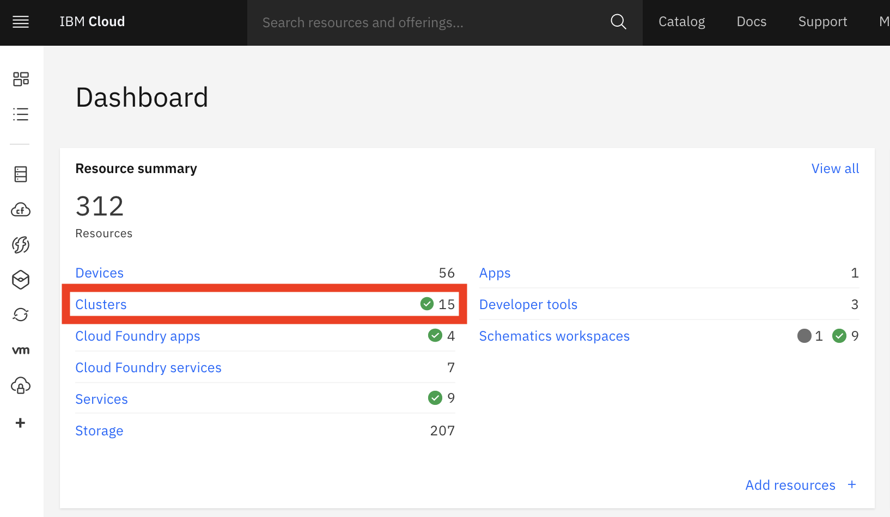
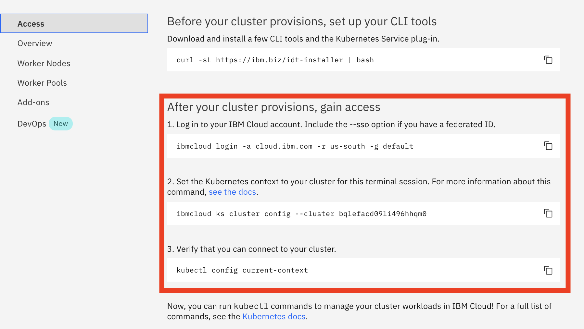

# Istio Security

The goals of Istio security are:

- Security by default: no changes needed to application code and infrastructure
- Defense in depth: integrate with existing security systems to provide multiple layers of defense
- Zero-trust network: build security solutions on distrusted networks


## Overview

Breaking down a monolithic application into atomic services offers various benefits, including better agility, better scalability and better ability to reuse services. However, microservices also have particular security needs:

- To defend against man-in-the-middle attacks, they need traffic encryption.
- To provide flexible service access control, they need mutual TLS and fine-grained access policies.
- To determine who did what at what time, they need auditing tools.

Istio Security provides a comprehensive security solution to solve these issues. Istio security mitigates both insider and external threats against your data, endpoints, communication, and platform.


The Istio security features provide strong identity, powerful policy, transparent TLS encryption, and authentication, authorization and audit (AAA) tools to protect your services and data. 


## Architecture

Security in Istio involves multiple components:

- A Certificate Authority (CA) for key and certificate management
- The configuration API server distributes to the proxies:
    * authentication policies
    * authorization policies
    * secure naming information
- Sidecar and perimeter proxies work as Policy Enforcement Points (PEPs) to secure communication between clients and servers.
- A set of Envoy proxy extensions to manage telemetry and auditing

The control plane handles configuration from the API server and configures the PEPs in the data plane. The PEPs are implemented using Envoy. The following diagram shows the architecture.


## Requirements

- IKS 1.16 or later with 3 workers (b3c.4x16 or better)
- Add-on Istio disabled
- CLI Client: 
    * ibmcloud
    * kubectl
    * istioctl


## Lab Flow

During the lab, you are going to

- Step 1. Clone the Repo
- Step 2. Download and Prepare Istio Installation Package
- Step 3. Connect to IBM Cloud and IKS Cluster
- Step 4. Install Istio to IKS Cluster
- Lab 1. Peer Authentication
- Lab 2. Request Authentication
- Lab 3. Authorization


### Step 1. Clone the Repo

To clone the repo,

1. Open your 1st terminal window.

1. Navigate to your preferred download folder. For example, `/tmp`.

1. Execute command

    ```
    $ git clone https://github.com/lee-zhg/intro-istio-security.git

    $ cd  intro-istio-security
    ```
1. Execute `pwd` command and take a note of your current folder. For example, `/tmp/intro-istio-security`.

1. Open the 2nd terminal window. You'll need multiple terminal windows for the exercise.

1. Navigate to the same folder as the 1st folder. It should be `/tmp/intro-istio-security` or your repo download folder. For example,

    ```
    cd /tmp/intro-istio-security
    ```


### Step 2. Download and Prepare Istio Installation Package

Istio v1.5 is the latest stable release at the time of this writing. To download and unpack Istio v1.5 to your IKS cluster,

1. Depending on your platform, download Istio v1.5 release.

    - MacOS: https://github.com/istio/istio/releases/download/1.5.0/istio-1.5.0-osx.tar.gz
    - Linux: https://github.com/istio/istio/releases/download/1.5.0/istio-1.5.0-linux.tar.gz
    - Windows: https://github.com/istio/istio/releases/download/1.5.0/istio-1.5.0-win.zip

1. Unzip the Istio package to the preferred folder. For example, `/tmp/istio-1.5.0`.

1. Open the 3rd terminal window.

1. Navigate to your unzipped Istio v1.5 installation folder. For example, `/tmp/istio-1.5.0`.


### Step 3. Connect to IBM Cloud and IKS Cluster

Most of exercises in this repo will be performed in both terminal windows that you prepared in the previous two sections. To successfully complete the rest of the steps, you must establish connection to IBM Cloud and your IKS cluster.

1. Login to IBM Cloud at https://cloud.ibm.com.

    

1. On the `IBM Cloud Dashboard`, select the `Clusters` link under the `Resource summary` section.

1. Select your cluster to open it.

1. Navigate to the `Access` tab.

    

1. Switch to the 1st terminal window.

1. Complete the steps in the `After your cluster provisions, gain access` section to setup connection to IBM Cloud as well as IKS cluster. 

1. Switch to the 2nd terminal window.

1. Complete the steps in the `After your cluster provisions, gain access` section to setup connection to IBM Cloud as well as IKS cluster.

1. Switch to the 3rd terminal window.

1. Complete the steps in the `After your cluster provisions, gain access` section to setup connection to IBM Cloud as well as IKS cluster. 


### Step 4. Install Istio to IKS Cluster

> **Note: This repo requires to install Istio on your Kubernetes cluster with the default configuration profile.**

> **Note: If the Istio requirement is not met, or you are uncertain if the Istio was installed with the default configuration profile, you must uninstall Istio, and then reinstall Istio by completing the setps in this section.**

To install Istio to your IKS cluster, 

1. Go to your 3rd terminal window. You should be in `/tmp/istio-1.5.0` folder or your Istio download folder.

1. Verify that your system is ready to install Istio.

    ```
	$ istioctl verify-install

    Checking the cluster to make sure it is ready for Istio installation...
    ......
    Install Pre-Check passed! The cluster is ready for Istio installation.
    ```

1. Install Istio to your IKS cluster. The command install the Istio with `default` profile. It also configures `proxy.privileged` to `true` which provides a way for you to verify data encryption of Data-in-Motion.

    ```
    $ istioctl manifest apply --set profile=default \
        --set values.global.proxy.privileged=true

    - Applying manifest for component Base...
    ✔ Finished applying manifest for component Base.
    - Applying manifest for component Pilot...
    ✔ Finished applying manifest for component Pilot.
    Waiting for resources to become ready...
    Waiting for resources to become ready...
    - Applying manifest for component IngressGateways...
    - Applying manifest for component AddonComponents...
    ✔ Finished applying manifest for component IngressGateways.
    ✔ Finished applying manifest for component AddonComponents.

    ✔ Installation complete
    ```

1. Verify the installation.

    ```
    $ istioctl manifest generate --set profile=default | istioctl verify-install -f -

    ......
    Checked 25 crds
    Checked 1 Istio Deployments
    Istio is installed successfully
    ```

1. Optionally, display the list of available profiles.

    ```
    $ istioctl profile list

    Istio configuration profiles:
        remote
        separate
        default
        demo
        empty
        minimal
    ```

1. Optionally, display the configuration of a profile.

    ```
    $ istioctl profile dump default
    ```

1. Optionally, compare profiles.

    ```
    $ istioctl profile diff default demo
    ```


#### 4.1 - Explore Istio Security 

No Istio authentication policy, authorization policy and destination rule are defined in a brand new environment with `default` profile.

1. You are still in the 3rd terminal window. You should be in `/tmp/istio-1.5.0` folder or your Istio download folder.

1. Verify that there is no `peer authentication` policy.

    ```
    $ kubectl get peerauthentication --all-namespaces

    No resources found
    ```

1. Verify that there is no `request authentication` policy.

    ```
    $ kubectl get requestauthentication --all-namespaces

    No resources found
    ```

1. Verify that there is no `destination rules` policy.

    ```
    $ kubectl get destinationrule --all-namespaces

    No resources found
    ```

1. Verify that there is no `authorization rules` policy.

    ```
    $ kubectl get authorizationpolicy --all-namespaces

    No resources found
    ```


### Lab 1. Peer Authentication

In this lab, you explore Istio peer authentication features. Follow the instructions in the [Peer Authentication Readme](README-peer-authentication.md)


### Lab 2. End-user Authentication - Request Authentication

In this lab, you explore Istio request authentication features. Follow the instructions in the [Request Authentication Readme](README-request-authentication.md)


### Lab 3. Authorization

In this lab, you explore Istio authorization features. Follow the instructions in the [Authorization Readme](README-authorization.md)


## Summary


## Uninstall Istio

To uninstall Istio add-on from your cluster,

    ```
    $ istioctl manifest generate --set profile=default | kubectl delete -f -
    ```


## Related Links

- [Open Cybersecurity Alliance](https://opencybersecurityalliance.org/)
- [Istio Concepts - Security](https://istio.io/docs/concepts/security/)
- [Istio Tasks - Security](https://istio.io/docs/tasks/security/)


