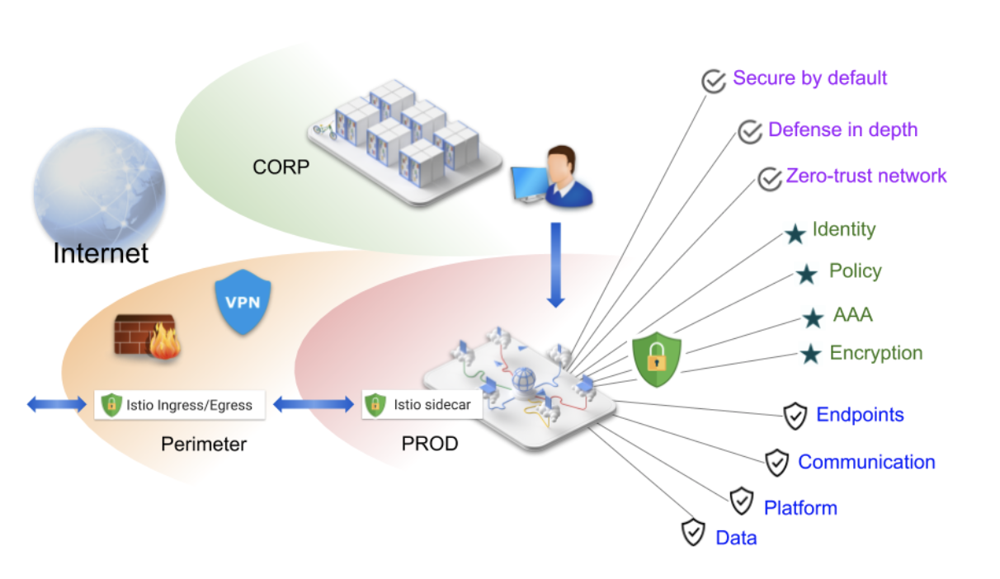
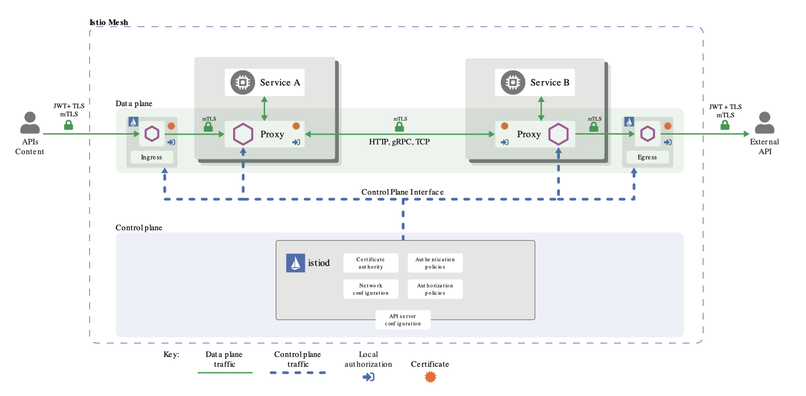

# Istio Security

The goals of Istio security are:

- Security by default: no changes needed to application code and infrastructure
- Defense in depth: integrate with existing security systems to provide multiple layers of defense
- Zero-trust network: build security solutions on distrusted networks

## Overview

Breaking down a monolithic application into atomic services offers various benefits, including better agility, better scalability and better ability to reuse services. However, microservices also have particular security needs:

- To defend against man-in-the-middle attacks, they need traffic encryption.
- To provide flexible service access control, they need mutual TLS and fine-grained access policies.
- To determine who did what at what time, they need auditing tools.

Istio Security provides a comprehensive security solution to solve these issues. Istio security mitigates both insider and external threats against your data, endpoints, communication, and platform.

The Istio security features provide strong identity, powerful policy, transparent TLS encryption, and authentication, authorization and audit (AAA) tools to protect your services and data. 

## Architecture

Security in Istio involves multiple components:

- A Certificate Authority (CA) for key and certificate management
- The configuration API server distributes to the proxies:
    * authentication policies
    * authorization policies
    * secure naming information
- Sidecar and perimeter proxies work as Policy Enforcement Points (PEPs) to secure communication between clients and servers.
- A set of Envoy proxy extensions to manage telemetry and auditing

The control plane handles configuration from the API server and configures the PEPs in the data plane. The PEPs are implemented using Envoy. The following diagram shows the architecture.

## Requirements

- IKS 1.16 or later with 3 workers (b3c.4x16 or better)
- Add-on Istio disabled
- CLI Client: 
    * ibmcloud
    * kubectl
    * istioctl

## Lab Flow

During the lab, you are going to
- install add-on Istio v1.5
- view unknown events without any custom change

### Clone the repo

### Download and instal

## Related Links

- [Open Cybersecurity Alliance](https://opencybersecurityalliance.org/)
- [Istio Concepts - Security](https://istio.io/docs/concepts/security/)
- [Istio Tasks - Security](https://istio.io/docs/tasks/security/)

