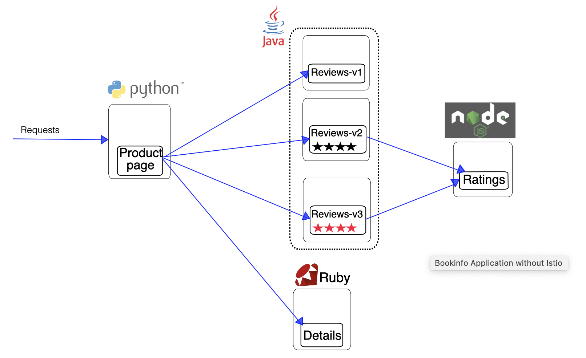
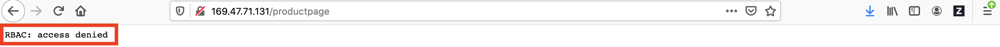
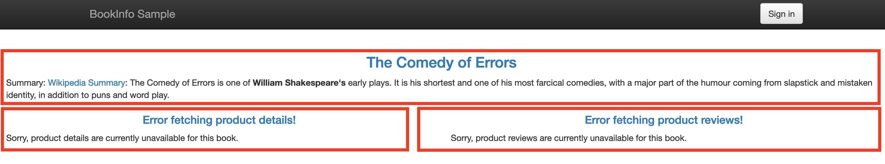

# Istio Security

The goals of Istio security are:

- Security by default: no changes needed to application code and infrastructure
- Defense in depth: integrate with existing security systems to provide multiple layers of defense
- Zero-trust network: build security solutions on distrusted networks


## Overview

Breaking down a monolithic application into atomic services offers various benefits, including better agility, better scalability and better ability to reuse services. However, microservices also have particular security needs:

- To defend against man-in-the-middle attacks, they need traffic encryption.
- To provide flexible service access control, they need mutual TLS and fine-grained access policies.
- To determine who did what at what time, they need auditing tools.

Istio Security provides a comprehensive security solution to solve these issues. Istio security mitigates both insider and external threats against your data, endpoints, communication, and platform.


The Istio security features provide strong identity, powerful policy, transparent TLS encryption, and authentication, authorization and audit (AAA) tools to protect your services and data. 


## Architecture

Security in Istio involves multiple components:

- A Certificate Authority (CA) for key and certificate management
- The configuration API server distributes to the proxies:
    * authentication policies
    * authorization policies
    * secure naming information
- Sidecar and perimeter proxies work as Policy Enforcement Points (PEPs) to secure communication between clients and servers.
- A set of Envoy proxy extensions to manage telemetry and auditing

The control plane handles configuration from the API server and configures the PEPs in the data plane. The PEPs are implemented using Envoy. The following diagram shows the architecture.


## Requirements

- IKS 1.16 or later with 3 workers (b3c.4x16 or better)
- Add-on Istio disabled
- CLI Client: 
    * ibmcloud
    * kubectl
    * istioctl


## Lab Flow

During the lab, you are going to

- Step 1. Clone the Repo
- Step 2. Download and Prepare Istio Installation Package
- Step 3. Connect to IBM Cloud and IKS Cluster
- Step 4. Install Istio to IKS Cluster
    - 4.1 - Explore Istio Security
- Step 5. Peer Authentication
    - 5.1 - Setup
    - 5.2 - Make Service-to-Service Calls in Container
    - 5.3 - Is Data-in-Motion Secured? - Network Traffic Monitoring
    - 5.4 - Make Service Call to Workload httpbin
    - 5.5 - Istio Auto Mutual TLS feature
    - 5.6 Is Data-in-Motion Secured?
    - 5.7 - Easy Method Identifying Mutual TLS
    - 5.8 - Peer Authentication without Change
    - 5.9 - Enabe Mesh-Wide Istio Mutual TLS in STRICT Mode
    - 5.10 - Enable Mutual TLS for a Namespace
    - 5.11 - Enable Mutual TLS for a Workload
    - 5.12 - Enable Mutual TLS for a Port
    - 5.13 - Policy Precedence
    - 5.14 - Peer Authentication Summary
- Step 6. Request Authentication
- Step 7. Authorization

### Step 1. Clone the Repo

To clone the repo,

1. Open your 1st terminal window.

1. Navigate to your preferred download folder. For example, `/tmp`.

1. Execute command

    ```
    $ git clone https://github.com/lee-zhg/intro-istio-security.git

    $ cd  intro-istio-security
    ```
1. Execute `pwd` command and take a note of your current folder. For example, `/tmp/intro-istio-security`.

1. Open the 2nd terminal window. You'll need multiple terminal windows for the exercise.

1. Navigate to the same folder as the 1st folder. It should be `/tmp/intro-istio-security` or your repo download folder. For example,

    ```
    cd /tmp/intro-istio-security
    ```


### Step 2. Download and Prepare Istio Installation Package

Istio v1.5 is the latest stable release at the time of this writing. To download and unpack Istio v1.5 to your IKS cluster,

1. Depending on your platform, download Istio v1.5 release.

    - MacOS: https://github.com/istio/istio/releases/download/1.5.0/istio-1.5.0-osx.tar.gz
    - Linux: https://github.com/istio/istio/releases/download/1.5.0/istio-1.5.0-linux.tar.gz
    - Windows: https://github.com/istio/istio/releases/download/1.5.0/istio-1.5.0-win.zip

1. Unzip the Istio package to the preferred folder. For example, `/tmp/istio-1.5.0`.

1. Open the 3rd terminal window.

1. Navigate to your unzipped Istio v1.5 installation folder. For example, `/tmp/istio-1.5.0`.


### Step 3. Connect to IBM Cloud and IKS Cluster

Most of exercises in this repo will be performed in both terminal windows that you prepared in the previous two sections. To successfully complete the rest of the steps, you must establish connection to IBM Cloud and your IKS cluster.

1. Login to IBM Cloud at https://cloud.ibm.com.

    

1. On the `IBM Cloud Dashboard`, select the `Clusters` link under the `Resource summary` section.

1. Select your cluster to open it.

1. Navigate to the `Access` tab.

    

1. Switch to the 1st terminal window.

1. Complete the steps in the `After your cluster provisions, gain access` section to setup connection to IBM Cloud as well as IKS cluster. 

1. Switch to the 2nd terminal window.

1. Complete the steps in the `After your cluster provisions, gain access` section to setup connection to IBM Cloud as well as IKS cluster.

1. Switch to the 3rd terminal window.

1. Complete the steps in the `After your cluster provisions, gain access` section to setup connection to IBM Cloud as well as IKS cluster. 


### Step 4. Install Istio to IKS Cluster

> **Note: This repo requires to install Istio on your Kubernetes cluster with the default configuration profile.**

> **Note: If the Istio requirement is not met, or you are uncertain if the Istio was installed with the default configuration profile, you must uninstall Istio, and then reinstall Istio by completing the setps in this section.**

To install Istio to your IKS cluster, 

1. Go to your 3rd terminal window. You should be in `/tmp/istio-1.5.0` folder or your Istio download folder.

1. Verify that your system is ready to install Istio.

    ```
	$ istioctl verify-install

    Checking the cluster to make sure it is ready for Istio installation...
    ......
    Install Pre-Check passed! The cluster is ready for Istio installation.
    ```

1. Install Istio to your IKS cluster. The command install the Istio with `default` profile. It also configures `proxy.privileged` to `true` which provides a way for you to verify data encryption of Data-in-Motion.

    ```
    $ istioctl manifest apply --set profile=default \
        --set values.global.proxy.privileged=true

    - Applying manifest for component Base...
    ✔ Finished applying manifest for component Base.
    - Applying manifest for component Pilot...
    ✔ Finished applying manifest for component Pilot.
    Waiting for resources to become ready...
    Waiting for resources to become ready...
    - Applying manifest for component IngressGateways...
    - Applying manifest for component AddonComponents...
    ✔ Finished applying manifest for component IngressGateways.
    ✔ Finished applying manifest for component AddonComponents.

    ✔ Installation complete
    ```

1. Verify the installation.

    ```
    $ istioctl manifest generate --set profile=default | istioctl verify-install -f -

    ......
    Checked 25 crds
    Checked 1 Istio Deployments
    Istio is installed successfully
    ```

1. Optionally, display the list of available profiles.

    ```
    $ istioctl profile list

    Istio configuration profiles:
        remote
        separate
        default
        demo
        empty
        minimal
    ```

1. Optionally, display the configuration of a profile.

    ```
    $ istioctl profile dump default
    ```

1. Optionally, compare profiles.

    ```
    $ istioctl profile diff default demo
    ```


#### 4.1 - Explore Istio Security 

No Istio authentication policy, authorization policy and destination rule are defined in a brand new environment with `default` profile.

1. You are still in the 3rd terminal window. You should be in `/tmp/istio-1.5.0` folder or your Istio download folder.

1. Verify that there is no `peer authentication` policy.

    ```
    $ kubectl get peerauthentication --all-namespaces

    No resources found
    ```

1. Verify that there is no `request authentication` policy.

    ```
    $ kubectl get requestauthentication --all-namespaces

    No resources found
    ```

1. Verify that there is no `destination rules` policy.

    ```
    $ kubectl get destinationrule --all-namespaces

    No resources found
    ```

1. Verify that there is no `authorization rules` policy.

    ```
    $ kubectl get authorizationpolicy --all-namespaces

    No resources found
    ```


### Step 5. Peer Authentication

Peer Authentication is used for communications between services within the same service mesh.

Since service-to-service communication does not typically involve human being, you'll use simulation methods to simulate the service-to-service communication for peer authentication related activities. The first couple of sections in this part of exercise help you understand the simulation methods.

> **Note: Exercise in this repo requires to install Istio on your Kubernetes cluster with the default configuration profile.**


#### 5.1 - Setup

As the Peer Authentication covers the communication between services within a service mesh, two microservices or workloads (both terms refer to the microservice that is deployed into the service mesh in this repo) will be deployed to three namespaces in your IKS cluster. 
- `httpbin`
- `sleep`

In namespace `foo` and `bar`, service `httpbin` and its `Istio Sidecar/Envoy proxy` run in seperate containers of pod 1. Similarly, service `sleep` and its `Istio Sidecar/Envoy proxy` run in seperate containers of pod 2.

In namespace `legacy`, service `httpbin` runs in a container of pod 1 without `Istio Sidecar/Envoy proxy`. Service `sleep` runs in a container of pod 2 without `Istio Sidecar/Envoy proxy`.


1. Go the 2nd terminal window. You should be in folder `/tmp/intro-istio-security` or your repo download folder.

1. Execute

    ```
    $ scripts/peer-auth-setup.sh
    ```
    The lab environment in the above diagram was created.


#### 5.2 - Make Service-to-Service Calls in Container

Now, you have both service `httpbin` and `sleep` containers running in three namespaces within the service mesh. To simulate the service-to-service communications within the mesh, you can make service call to `httpbin` workload in one of the three namespaces, from the `sleep` container running in either the same namespace or different one.

To be able to make service call from `sleep` workload, you need to get into the container in your IKS cluster where service `sleep` is deployed and running. 

That's what command `docker container exec` and `kubectl exec` are for.

##### 5.2.1 - Review "docker container exec" Command

You can execute command within a container running locally,

1. Open a new terminla window.

1. Start a local docker container

    ```
    $ docker container run -t ubuntu top
    ```

    The command starts a container with the `ubuntu` image using the `top` command. The -t flags allocates a pseudo-TTY which is needed for the `top` commandto work correctly. `top` command keeps the container alive.

1. Go to your 2nd terminal window. You should be in folder `/tmp/intro-istio-security` or your repo download folder.

1. Retrieve the running container ID.

    ```
    $ docker container ls

    CONTAINER ID        IMAGE               COMMAND             CREATED             STATUS              PORTS               NAMES
    50411b2b0116        ubuntu              "top"               4 minutes ago       Up 4 minutes                            gracious_wiles
    ```

1. Evaluate running processes in the container.

    ```
    $ docker container exec -it 50411b2b0116 ps -ef

    UID        PID  PPID  C STIME TTY          TIME CMD
    root         1     0  0 01:50 pts/0    00:00:00 top
    root        30     0  0 02:08 pts/1    00:00:00 ps -ef
    ```

    > Note, you must replace container ID `50411b2b0116` with your container ID retrieved by `docker container ls` command.

    Command `docker container exec -it 50411b2b0116` allows you to get into your container. Command `ps -ef` is the action that you took within your container. In this case, you retrieved the running processes in the container.

1. Go back to your new terminal window and CTL-C to stop the running local container.

##### 5.2.2 - Review `kubectl exec` Command 

You can execute command within a container running in your IKS cluster. To do so, you need both pod ID and container name where a service is running.

1. Go the 2nd terminal window. You should be in folder `/tmp/intro-istio-security` or your repo download folder.

1. Retrieve pod ID of pod 1 where service `httpbin` is running in namespace `foo`.

    ```
    $ export httpbin_in_foo=`kubectl get pod -nfoo -lapp=httpbin -ojsonpath={.items..metadata.name}`

    $ echo $httpbin_in_foo

    httpbin-7f58565dc-7kr42
    ```

1. Evaluate running processes in the container hosting sidecar of the same pod (service `istio-proxy`) within namespace `foo`.

    ```
    $ kubectl exec -nfoo $httpbin_in_foo -c istio-proxy -it -- ps -ef

    UID         PID   PPID  C STIME TTY          TIME CMD
    istio-p+      1      0  0 May07 ?        00:00:09 /usr/local/bin/pilot-agent pro
    istio-p+     20      1  0 May07 ?        00:00:46 /usr/local/bin/envoy -c /etc/i
    istio-p+     33      0  0 02:38 pts/0    00:00:00 ps -ef
    ```

    Command `kubectl exec -nfoo $httpbin_in_foo -c istio-proxy -it` allows you to get into your container hosting the sidecar of the same pod (pod 1) where service `httpbin` is running within namespace `foo`. Command `ps -ef` is the action that you took within the container. In this case, you retrieved the running processes in the container.

    

1. Combine the above two commands, you can get the same result by running one command which executes `ps -ef` command in that container.

    ```
    $ kubectl exec -nfoo $(kubectl get pod -nfoo -lapp=httpbin -ojsonpath={.items..metadata.name}) -c istio-proxy -it -- ps -ef
    ```


#### 5.3 - Is Data-in-Motion Secured? - Network Traffic Monitoring

Running command `ps -ef` in sidecar container of pod 1 of namespace `foo` can be helpful. However, running command `tcpdump` (instead of `ps -ef`) can be much more useful. It allows you to monitor network traffic of the pod where the sidecar container is running.

1. You are still in the 2nd terminal window. You should be in folder `/tmp/intro-istio-security` or your repo download folder.

1. Monitor network traffic of pod 1 in the namespace `foo`.

    ```
    $ kubectl exec -nfoo $(kubectl get pod -nfoo -lapp=httpbin -ojsonpath={.items..metadata.name}) -c istio-proxy -it -- sudo tcpdump dst port 80 -A

    tcpdump: verbose output suppressed, use -v or -vv for full protocol decode
    listening on eth0, link-type EN10MB (Ethernet), capture size 262144 bytes
    ```

    Command `tcpdump` dumps the TCP traffic occuring at a server. In this case, it's the sidecar container of the pod 1 where service `httpbin` is running in namespace `foo`. Because a sidecar takes over the network communications of the pod, `tcpdump` dump of the sidecar essentially reflects the network traffic of the entire pod.

    So, command `tcpdump dst port 80 -A` running in this sidecar container is monitoring the netwrok traffic of the pod 1 in the namespace `foo`. Now, if you can make service call to the `httpbin` service in namespace `foo`, you can verify if the network traffic is encrypted or not. In another word, you can verify if you have secured data-in-motion for network traffic between services within the service mesh.

    

1. You started monitoring network traffic of pod 1 in the namespace `foo`. You can go back to the 2nd terminal window anytime to check the network traffic information.


#### 5.4 - Make Service Call to Workload httpbin

You can use the same method to get access to other containers running in your IKS cluster, and then make call to the workload `httpbin` in the namespace `foo`. 

For the rest of repo, the workload `httpbin` in the namespace `foo` is referred as `httpbin.foo`.

1. Go to the 1st terminal window as the 2nd one is busy now. You should be in folder `/tmp/intro-istio-security` or your repo download folder.

1. Make service call from `sleep.legacy` to `httpbin.foo`.

    ```
    $ kubectl exec $(kubectl get pod -l app=sleep -n legacy -o jsonpath={.items..metadata.name}) -c sleep -n legacy -- curl http://httpbin.foo:8000/ip -s -o /dev/null -w "%{http_code}\n"

    200
    ```

    As explained in the previous sections, `$(kubectl get pod -l app=sleep -n legacy -o jsonpath={.items..metadata.name})` retrieve pod ID where sleep.legacy is running.

    `kubectl exec $(kubectl get pod -l app=sleep -n legacy -o jsonpath={.items..metadata.name}) -c sleep -n legacy` allows you to execute commands within the container just like you have login to the container. `-c sleep` specifies the container name and `-n legacy` specifies the namespace.

    `curl http://httpbin.foo:8000/ip -s -o /dev/null -w "%{http_code}\n"` is the command that is issued within the container. The command calls the `httpbin.foo` service by issuing curl command and return the http response code.


#### 5.5 - Istio Auto Mutual TLS feature

Istio v1.4 or later offers **auto mutual TLS** feature. You can adopt mutual TLS by only configuring authentication policy without worrying about destination rule. This allows you to adopt Istio mutual TLS incrementally with minimal manual configuration.

Istio tracks the server workloads that have Istio sidecar, and configures client sidecar to send `mutual TLS traffic` (encrypted traffic) to those server workloads automatically, and send `plain text traffic` to server workloads without sidecars.

1. You are still in the 1st terminal window. You should be in folder `/tmp/intro-istio-security` or your repo download folder.

1. The `default` profile enables **auto mutual TLS** feature. You can verify `enableAutoMtls` setting with the command below.

    ```
    $ istioctl manifest generate --set profile=default | grep "enableAutoMtls"

    enableAutoMtls: true
    ```


#### 5.6 Is Data-in-Motion Secured?

Up to this point, you have started network traffic monitoring of `httpbin.foo` service and have a way to send requests to the service httpbin.foo from another workload within the IKS cluster. 

You are ready to verify if the network traffic between services within your IKS cluster is encrypted or secured. Because of the **auto mutual TLS** feature, it's possible to encrypt network traffic without defining any peer authentication policy.

##### 5.6.1. Send Service Requests from sleep.legacy to httpbin.foo

Istio sidecar was not installed in the namespace `legacy` when you deployed workload `sleep` and `httpbin` in the lab environment. 

When you send service requests from `sleep.legacy` (workload `sleep` in the namespace `legacy`) to `httpbin.foo` (workload `httpbin` in namespace `foo`), the service request should be sent in `plain texts format` because `sleep.legacy` does not have a sidecar and **auto mutual TLS** feature is enabled for the lab environment as you have verified in the previous section.

1. You are still in the 1st terminal window. You should be in folder `/tmp/intro-istio-security` or your repo download folder.

1. Sent service requests from `sleep.legacy` to `httpbin.foo`.

    ```
    $ kubectl exec $(kubectl get pod -l app=sleep -n legacy -o jsonpath={.items..metadata.name}) -c sleep -n legacy -- curl http://httpbin.foo:8000/ip -s -o /dev/null -w "%{http_code}\n"

    200
    ```

1. Go to the 2nd terminal window and observe the network traffic caused by the previous command. 

    ```
    23:08:10.738542 IP 172-30-85-248.sleep.legacy.svc.cluster.local.50142 > httpbin-7f58565dc-7kr42.80: Flags [.], ack 1043857359, win 128, options [nop,nop,TS val 3229339027 ecr 1172808967], length 0
    E..4.q@.>.....U....<...PN...>7.............
    .{..E...
    23:08:10.738773 IP 172-30-85-248.sleep.legacy.svc.cluster.local.50142 > httpbin-7f58565dc-7kr42.80: Flags [P.], seq 0:82, ack 1, win 128, options [nop,nop,TS val 3229339027 ecr 1172808967], length 82: HTTP: GET /ip HTTP/1.1
    E....r@.>.....U....<...PN...>7......|......
    .{..E...GET /ip HTTP/1.1
    Host: httpbin.foo:8000
    User-Agent: curl/7.64.0
    Accept: */*
    ```

    **IP 172-30-85-248.sleep.legacy.svc.cluster.local.50142 > httpbin-7f58565dc-7kr42.80** shows that the network traffic were from `IP 172-30-85-248.sleep.legacy.svc.cluster.local.50142` to `httpbin-7f58565dc-7kr42.80`.

    **length 82: HTTP: GET /ip HTTP/1.1**, **Host: httpbin.foo:8000** and **User-Agent: curl/7.64.0** show the detail information of the workload request.

1. You have verifed that the network traffic payload between workload `sleep.legacy` and workload `httpbin.foo` was in `plain text` format. 

    `Data-in-motion` is not enabled in this use case because `sleep.legacy` does not have a Istio sidecar. Istio tracks all these information. When a service request goes out from `sleep.legacy`, it's sent as `plain text` payload. The same is true for the reply payload from `httpbin.foo`.

##### 5.6.2. Send Service Requests from sleep.bar to httpbin.foo

Istio sidecar was deployed in the namespace `bar` when you deployed workload `sleep` and `httpbin` in the lab environment. 

When you send service requests from `sleep.bar` (workload `sleep` in the namespace `bar`) to `httpbin.foo` (workload `httpbin` in namespace `foo`), the service request should be sent in `encrypted format` because `sleep.bar` does have a sidecar and **auto mutual TLS** feature is enabled for the lab environment as you have verified in the previous section.

1. Go to the 1st terminal window. You should be in folder `/tmp/intro-istio-security` or your repo download folder.

1. Sent service requests from `sleep.bar` to `httpbin.foo`.

    ```
    $ kubectl exec $(kubectl get pod -l app=sleep -n bar -o jsonpath={.items..metadata.name}) -c sleep -n bar -- curl http://httpbin.foo:8000/ip -s -o /dev/null -w "%{http_code}\n"

    200
    ```

1. Go to the 2nd terminal window and observe the network traffic caused by the previous command. 

1. You can still find the source and destination of the network traffic. **IP 172-30-93-35.sleep.bar.svc.cluster.local.51592 > httpbin-7f58565dc-7kr42.80** shows that the network traffic were from `IIP 172-30-93-35.sleep.bar.svc.cluster.local.51592` to `httpbin-7f58565dc-7kr42.80`.

1. However, the detail information of the service request itself can't be found in the traffic payload. When you made the similar service request from `sleep.legacy` container, the detail information of the service request was found in the traffic payload as below.

    ```
    .{..E...GET /ip HTTP/1.1
    Host: httpbin.foo:8000
    User-Agent: curl/7.64.0
    Accept: */*
    ```

1. You have verifed that the communication payload between workload `sleep.bar` and workload `httpbin.foo` was in `encypted` format. In other word, `Istio mutual TLS` helps you accomplish `data-in-motion` security without any change to your application.

    `Data-in-motion` is accomplished in this use case because `sleep.bar` does have a Istio sidecar. Istio tracks all these information. When a service request goes out from `sleep.bar`, it's sent as `encypted` payload. The same is true for the reply payload from `httpbin.foo`.


#### 5.7 - Easy Method Identifying Mutual TLS

It's great that you have a way to check if mutual TLS is effective and if the network traffic payload is encypted. However, the method requires to review `tcpdump` dumps. Not quite comvenient and tuitive. 

In this section, you are going to identify a better way.

1. You are still in the 1st terminal window. You should be in folder `/tmp/intro-istio-security` or your repo download folder.

1. Make a service call to `httpbin.foo` workload from `sleep.legacy`. Based on the conclusion from the previous section, the payload of network traffic between `httpbin.foo` and `sleep.legacy` are in `plain text`.

    ```
    $ kubectl exec $(kubectl get pod -l app=sleep -n legacy -o jsonpath={.items..metadata.name}) -c sleep -n legacy -- curl http://httpbin.foo:8000/headers  -s  -w "response code: %{http_code}\n"
    ```

1. The command returns

    ```
    {
      "headers": {
        "Accept": "*/*", 
        "Content-Length": "0", 
        "Host": "httpbin.foo:8000", 
        "User-Agent": "curl/7.64.0", 
        "X-B3-Sampled": "0", 
        "X-B3-Spanid": "2538408a97212eb2", 
        "X-B3-Traceid": "b49dabfa9447b62a2538408a97212eb2"
      }
    }
    response code: 200
    ```

1. Make a service call to `httpbin.foo` workload from `sleep.bar`. Based on the conclusion from the previous section, the payload of network traffic between `httpbin.foo` and `sleep.bar` are `encrypted`.

    ```
    $ kubectl exec $(kubectl get pod -l app=sleep -n bar -o jsonpath={.items..metadata.name}) -c sleep -n bar -- curl http://httpbin.foo:8000/headers  -s  -w "response code: %{http_code}\n"
    ```

1. The command returns

    ```
    {
      "headers": {
        "Accept": "*/*", 
        "Content-Length": "0", 
        "Host": "httpbin.foo:8000", 
        "User-Agent": "curl/7.64.0", 
        "X-B3-Parentspanid": "a8ff76317b935ab9", 
        "X-B3-Sampled": "0", 
        "X-B3-Spanid": "3c2a16993c2964a6", 
        "X-B3-Traceid": "ab62e2c5018b67f0a8ff76317b935ab9", 
        "X-Forwarded-Client-Cert": "By=spiffe://cluster.local/ns/foo/sa/httpbin;Hash=434b9f09db06f82a9f612ce1a056dfae8c9ba4da72936b100c54c3bb240abc07;Subject=\"\";URI=spiffe://cluster.local/ns/bar/sa/sleep"
      }
    }
    response code: 200
    ```

1. Compare the return of the last two commands, the only difference is that the header of the request from `sleep.var` to `httpbin.foo` has additional component as shown below.

    ```
        "X-Forwarded-Client-Cert": "By=spiffe://cluster.local/ns/foo/sa/httpbin;Hash=434b9f09db06f82a9f612ce1a056dfae8c9ba4da72936b100c54c3bb240abc07;Subject=\"\";URI=spiffe://cluster.local/ns/bar/sa/sleep"
    ```

1. When using mutual TLS, the sidecar/proxy injects the `X-Forwarded-Client-Cert` header to the upstream request to the backend. That header’s presence is evidence that mutual TLS is used. 

1. With this discovery, now you can easily identify if mutual TLS is used (same as if the traffic payload is encrypted) for a service-to-service communication. You only have to modify the last two commands slightly to check if the request header contains `X-Forwarded-Client-Cert` component.

1. Make a service call to `httpbin.foo` workload from `sleep.legacy`. 

    ```
    $ kubectl exec $(kubectl get pod -l app=sleep -n legacy -o jsonpath={.items..metadata.name}) -c sleep -n legacy -- curl http://httpbin.foo:8000/headers  -s  -w "response code: %{http_code}\n" | egrep -o 'X-Forwarded-Client-Cert*|response.*$'

    response code: 200
    ```

    The request header does not contain `X-Forwarded-Client-Cert` component. The network traffic payload is in `plain text`. This is consistent with what you already knew.

1. Make a service call to `httpbin.foo` workload from `sleep.bar`.

    ```
    $ kubectl exec $(kubectl get pod -l app=sleep -n bar -o jsonpath={.items..metadata.name}) -c sleep -n bar -- curl http://httpbin.foo:8000/headers  -s  -w "response code: %{http_code}\n" | egrep -o 'X-Forwarded-Client-Cert*|response.*$'

    X-Forwarded-Client-Cert
    response code: 200
    ```

    The request header does contain `X-Forwarded-Client-Cert` component. The network traffic payload is `encrypted`. This is also consistent with what you already knew.

1. Congratulation. You have a better and easy way to identify if `mutual TLS` is used, if the network traffic payload is `encrypted` without monitring network traffic.


#### 5.8 - Peer Authentication without Change

You have deployed two microservices/workloads to three namespaces in your IKS cluster. 
- `httpbin`
- `sleep`

In namespace `foo` and `bar`, service `httpbin` and its `Istio Sidecar/Envoy proxy` run in seperate containers of pod 1. Similarly, service `sleep` and its `Istio Sidecar/Envoy proxy` run in seperate containers of pod 2.

In namespace `legacy`, service `httpbin` runs in a container of pod 1 without `Istio Sidecar/Envoy proxy`. Service `sleep` runs in a container of pod 2 without `Istio Sidecar/Envoy proxy`.


For the rest of peer authentication discussion, you are going to make configuration changes and observe how the changes effect to the mutual TLS. 

Before making any change, observe the default `peer authetication`.

1. You are still in the 1st terminal window. You should be in folder `/tmp/intro-istio-security` or your repo download folder.

1. Check the communications between `sleep` workload and `httpbin` workload for all namespaces and their current effective `mutual TLS`.

    ```
    $ scripts/sleep-to-httpbin-test.sh

    -----
    X-Forwarded-Client-Cert
    TEST: sleep.foo to httpbin.foo: 200
    -----
    X-Forwarded-Client-Cert
    TEST: sleep.foo to httpbin.bar: 200
    -----
    TEST: sleep.foo to httpbin.legacy: 200
    -----
    X-Forwarded-Client-Cert
    TEST: sleep.bar to httpbin.foo: 200
    -----
    X-Forwarded-Client-Cert
    TEST: sleep.bar to httpbin.bar: 200
    -----
    TEST: sleep.bar to httpbin.legacy: 200
    -----
    TEST: sleep.legacy to httpbin.foo: 200
    -----
    TEST: sleep.legacy to httpbin.bar: 200
    -----
    TEST: sleep.legacy to httpbin.legacy: 200
    -----
    ```

1. Return code `200` shows that all communications between `sleep` workload and `httpbin` workload are permitted at the moment.

1. `X-Forwarded-Client-Cert` indicates that the communications between `sleep` workload and `httpbin` workload are encrypted and secured (`mutual TLS` is in effective). At the momeent, the following communications are secured.

    - sleep.foo to httpbin.foo
    - sleep.foo to httpbin.bar
    - sleep.bar to httpbin.foo
    - sleep.bar to httpbin.bar

    The communications between other workloads are not encrypted or unsecured.


#### 5.9 - Enabe Mesh-Wide Istio Mutual TLS in STRICT Mode

You have learned how `Auto mutual TLS` works in the previous section. It's a great feature that can help onboarding Istio as both secured and unsecured communications are permitted with the IKS cluster. 

To prevent non-mutual TLS for the whole mesh, you can set a `mesh-wide peer authentication policy` to set mutual TLS mode to `STRICT`. The mesh-wide peer authentication policy shouldn’t have a selector section, and it must apply to the root namespace. The default namespace `istio-system` is used below.

```
apiVersion: "security.istio.io/v1beta1"
kind: "PeerAuthentication"
metadata:
  name: "default"
  namespace: "istio-system"
spec:
  mtls:
    mode: STRICT
```

This peer authentication policy has the following effects: - It configures all workloads in the mesh to only accept requests encrypted with TLS. Since it doesn’t specify a value for the selector field, the policy applies to all workloads in the mesh.

1. You are still in the 1st terminal window. You should be in folder `/tmp/intro-istio-security` or your repo download folder.

1. Create a mesh-wide peer authentication policy.

    ```
    $ scripts/mesh-peer-auth-policy.sh

    -----Create Mesh-Wide Peer Authentication Policy-----
    peerauthentication.security.istio.io/default created
    ```

1. Verify new peer authentication policy.

    ```
    $ kubectl get peerauthentication --all-namespaces

    NAMESPACE      NAME      AGE
    istio-system   default   117s
    ```

1. Check the impact of the new mess-wide peer authentication policy on the communications between `sleep` workload and `httpbin` workload for all namespaces.

    ```
    $ scripts/sleep-to-httpbin-test.sh

    -----
    X-Forwarded-Client-Cert
    TEST: sleep.foo to httpbin.foo: 200
    -----
    X-Forwarded-Client-Cert
    TEST: sleep.foo to httpbin.bar: 200
    -----
    TEST: sleep.foo to httpbin.legacy: 200
    -----
    X-Forwarded-Client-Cert
    TEST: sleep.bar to httpbin.foo: 200
    -----
    X-Forwarded-Client-Cert
    TEST: sleep.bar to httpbin.bar: 200
    -----
    TEST: sleep.bar to httpbin.legacy: 200
    -----
    TEST: sleep.legacy to httpbin.foo: 000
    command terminated with exit code 56
    -----
    TEST: sleep.legacy to httpbin.bar: 000
    command terminated with exit code 56
    -----
    TEST: sleep.legacy to httpbin.legacy: 200
    -----
    ```

1. The only difference is that the communication failed for the requests from the client without proxy - `sleep.legacy`, to the workload with a proxy - `httpbin.foo` or `httpbin.bar`. This is expected as the mutual TLS is now strictly enforced by Istio. The workload without sidecar can not comply.

1. The communication to `httpbin.legacy` is still working because the workload does not have `Istio sidecar`. No matter the requests are from clients with sidecar - `httpbin.foo` or `httpbin.bar`, or from client without sidecar - `sleep.legacy`. When the server workload (the one receives service request) does not have `Istio sidecar`, the service request goes straight to the workload itself. So, no Istio policy is in effective for the workload. 

1. When a service request comes from a workload with Itsio sidecar(`httpbin.foo` or `httpbin.bar`) and goes to a workload without sidecar(`sleep.legacy`), Istio knows about it because Istio tracks the information. Istio sends the request in `plain text` to the destination. The above result of `httpbin.foo` request to `sleep.legacy` and `httpbin.bar` request to `sleep.legacy` verify it. It only has return code 200. `X-Forwarded-Client-Cert` is not added to header.

1. Remove global authentication policy.

    ```
    $ kubectl delete peerauthentication -n istio-system default

    peerauthentication.security.istio.io "default" deleted
    ```


#### 5.10 - Enable Mutual TLS for a Namespace

To change `mutual TLS` for all workloads within a particular namespace, use a `namespace-wide policy`. The specification of the policy is the same as for a mesh-wide policy, but you specify the namespace it applies to under metadata. For example, the following peer authentication policy enables strict mutual TLS for the `foo` namespace.

```
apiVersion: "security.istio.io/v1beta1"
kind: "PeerAuthentication"
metadata:
  name: "namespace-wide-policy"
  namespace: "foo"
spec:
  mtls:
    mode: STRICT
```

This peer authentication policy configures all workloads in the namespace `foo` to only accept requests encrypted with TLS. Since it doesn’t specify a value for the selector field, the policy applies to all workloads in the namespace.

1. You are still in the 1st terminal window. You should be in folder `/tmp/intro-istio-security` or your repo download folder.

1. Create a namespace-wide peer authentication policy.

    ```
    $ scripts/namespace-peer-auth-policy.sh

    -----Create Namespace-Wide Peer Authentication Policy-----
    peerauthentication.security.istio.io/namespace-wide-policy created
    ```

1. Verify new peer authentication policy.

    ```
    $ kubectl get peerauthentication --all-namespaces

    NAMESPACE   NAME                    AGE
    foo         namespace-wide-policy   44s
    ```

1. Check the impact of the new namespace-wide peer authentication policy on the communications between `sleep` workload and `httpbin` workload for all namespaces.

    ```
    $ scripts/sleep-to-httpbin-test.sh

    -----
    X-Forwarded-Client-Cert
    TEST: sleep.foo to httpbin.foo: 200
    -----
    X-Forwarded-Client-Cert
    TEST: sleep.foo to httpbin.bar: 200
    -----
    TEST: sleep.foo to httpbin.legacy: 200
    -----
    X-Forwarded-Client-Cert
    TEST: sleep.bar to httpbin.foo: 200
    -----
    X-Forwarded-Client-Cert
    TEST: sleep.bar to httpbin.bar: 200
    -----
    TEST: sleep.bar to httpbin.legacy: 200
    -----
    TEST: sleep.legacy to httpbin.foo: 000
    command terminated with exit code 56
    -----
    TEST: sleep.legacy to httpbin.bar: 200
    -----
    TEST: sleep.legacy to httpbin.legacy: 200
    -----
    ```

1. As this policy is applied to workloads in namespace `foo` only, only request from client-without-sidecar (`sleep.legacy`) to `httpbin.foo` fails. Request from `sleep.legacy` to `httpbin.bar` works fine.

1. Remove namespace-wide peer authentication policy.

    ```
    $ kubectl delete peerauthentication -n foo namespace-wide-policy

    peerauthentication.security.istio.io "namespace-wide-policy" deleted
    ```


#### 5.11 - Enable Mutual TLS for a Workload

To set a peer authentication policy for a specific workload, you must configure the `selector` section and specify the `labels` that match the desired workload. 

Istio can not aggregate workload-level policies for outbound mutual TLS traffic to a service. You can configure a `destination rule` along with workload-level peer authentication policy to manage that behavior.

The following peer authentication policy and destination rule enable strict mutual TLS for the `httpbin.bar` workload.

```
apiVersion: "security.istio.io/v1beta1"
kind: "PeerAuthentication"
metadata:
  name: "workload-httpbin-policy"
  namespace: "bar"
spec:
  selector:
    matchLabels:
      app: httpbin
  mtls:
    mode: STRICT
```

And a destination rule,

```
apiVersion: "networking.istio.io/v1alpha3"
kind: "DestinationRule"
metadata:
  name: "httpbin"
spec:
  host: "httpbin.bar.svc.cluster.local"
  trafficPolicy:
    tls:
      mode: ISTIO_MUTUAL
```

`name: "httpbin"` points to the destination workload of `httpbin`. `host: "httpbin.bar.svc.cluster.local"` points to the namespace `bar`. The traffic policy is defined as `mode: ISTIO_MUTUAL`.

1. You are still in the 1st terminal window. You should be in folder `/tmp/intro-istio-security` or your repo download folder.

1. Create a workload-specific peer authentication policy.

    ```
    $ scripts/workload-peer-auth-policy.sh

    -----Create Workload-Specific Peer Authentication Policy-----
    peerauthentication.security.istio.io/workload-httpbin-policy created
    ```

1. Create a destination rule.

    ```
    $ scripts/workload-httpbin-destination-rule.sh

    -----Create Workload-httpbin Destination Rule-----
    destinationrule.networking.istio.io/httpbin created
    ```

1. Verify new peer authentication policy.

    ```
    $ kubectl get peerauthentication --all-namespaces

    NAMESPACE   NAME                      AGE
    bar         workload-httpbin-policy   60s
    ```

1. Verify new destination rule.

    ```
    $ kubectl get destinationrules.networking.istio.io --all-namespaces -o yaml | grep "host:"

    host: httpbin.bar.svc.cluster.local
    ```

1. Check the impact of the new workload-specific peer authentication policy and its destination rule on the communications between `sleep` workload and `httpbin` workload for all namespaces.

    ```
    $ scripts/sleep-to-httpbin-test.sh

    -----
    X-Forwarded-Client-Cert
    TEST: sleep.foo to httpbin.foo: 200
    -----
    X-Forwarded-Client-Cert
    TEST: sleep.foo to httpbin.bar: 200
    -----
    TEST: sleep.foo to httpbin.legacy: 200
    -----
    X-Forwarded-Client-Cert
    TEST: sleep.bar to httpbin.foo: 200
    -----
    X-Forwarded-Client-Cert
    TEST: sleep.bar to httpbin.bar: 200
    -----
    TEST: sleep.bar to httpbin.legacy: 200
    -----
    TEST: sleep.legacy to httpbin.foo: 200
    -----
    TEST: sleep.legacy to httpbin.bar: 000
    command terminated with exit code 56
    -----
    TEST: sleep.legacy to httpbin.legacy: 200
    -----
    ```

1. As this policy is only applied to workload `httpbin` in namespace `bar`, the request from `sleep.legacy` (client-without-sidecar) to `httpbin.bar` fails. Request from `sleep.legacy` to `httpbin.foo` works fine.

1. Remove workload peer authentication policy.

    ```
    $ kubectl delete peerauthentication -n bar workload-httpbin-policy

    peerauthentication.security.istio.io "workload-httpbin-policy" deleted
    ```

1. Remove the destination rule.

    ```
    $ kubectl delete destinationrules httpbin -n bar

    destinationrule.networking.istio.io "httpbin" deleted
    ```


#### 5.12 - Enable Mutual TLS for a Port

It's possible to refine the mutual TLS settings for a specific port of a workload. It's configured in the `portLevelMtls` section. For example, the following peer authentication policy requires mutual TLS on all ports, except port 80.

```
apiVersion: "security.istio.io/v1beta1"
kind: "PeerAuthentication"
metadata:
  name: "port-workload-httpbin-policy"
  namespace: "bar"
spec:
  selector:
    matchLabels:
      app: httpbin
  mtls:
    mode: STRICT
  portLevelMtls:
    80:
      mode: DISABLE
```

Basically, you add `portlevelMtls` section to the end of a `workload` policy when creating a `port` policy. In this case, you choose port 80 and define `mode: DISABLE`.

The destination rule goes with the above peer authentication policy.

```
apiVersion: "networking.istio.io/v1alpha3"
kind: "DestinationRule"
metadata:
  name: "httpbin"
spec:
  host: httpbin.bar.svc.cluster.local
  trafficPolicy:
    tls:
      mode: ISTIO_MUTUAL
    portLevelSettings:
    - port:
        number: 8000
      tls:
        mode: DISABLE
```

Similarly, `portLevelSettings:` is added to the `workload` destination rule. Port 8000 and `tls mode: DISABLE` are included.

1. You are still in the 1st terminal window. You should be in folder `/tmp/intro-istio-security` or your repo download folder.

1. Create a port-specific peer authentication policy.

    ```
    $ scripts/port-workload-peer-auth-policy.sh

    -----Create Port-Workload-Specific Peer Authentication Policy-----
    peerauthentication.security.istio.io/port-workload-httpbin-policy created
    ```

1. Create a destination rule.

    ```
    $ scripts/port-workload-httpbin-destination-rule.sh

    -----Create Port-Workload-httpbin Destination Rule-----
    destinationrule.networking.istio.io/httpbin created
    ```

1. Verify new peer authentication policy.

    ```
    $ kubectl get peerauthentication --all-namespaces

    NAMESPACE   NAME                           AGE
    bar         port-workload-httpbin-policy   53s
    ```

1. Verify new destination rule.

    ```
    $ kubectl get destinationrules.networking.istio.io --all-namespaces -o yaml | grep "host:"

    host: httpbin.bar.svc.cluster.local
    ```

1. Check the impact of the new port-workload-specific peer authentication policy and its destination rule on the communications between `sleep` workload and `httpbin` workload for all namespaces.

    ```
    $ scripts/sleep-to-httpbin-test.sh

    -----
    X-Forwarded-Client-Cert
    TEST: sleep.foo to httpbin.foo: 200
    -----
    TEST: sleep.foo to httpbin.bar: 200
    -----
    TEST: sleep.foo to httpbin.legacy: 200
    -----
    X-Forwarded-Client-Cert
    TEST: sleep.bar to httpbin.foo: 200
    -----
    TEST: sleep.bar to httpbin.bar: 200
    -----
    TEST: sleep.bar to httpbin.legacy: 200
    -----
    TEST: sleep.legacy to httpbin.foo: 200
    -----
    TEST: sleep.legacy to httpbin.bar: 200
    -----
    TEST: sleep.legacy to httpbin.legacy: 200
    -----
    ```

1. The request from `sleep.legacy` to `httpbin.bar` is permitted now because `mutual TLS` is `disabled` for requests to external port 80 (container port 8000) of `httpbin.bar` by the new peer authentication policy `port-workload-httpbin-policy`.

1. The requests from `sleep.foo` to `httpbin.bar` and from `sleep.bar` to `httpbin.bar` are transmitted in `plain text` because `mutual TLS` is `disabled` for requests to external port 80 (container port 8000) of `httpbin.bar` by the new peer authentication policy `port-workload-httpbin-policy`.

> Note: The port value in the peer authentication policy is the container’s port. The value the destination rule is the service’s port.

> Note: You can only use portLevelMtls if the port is bound to a service. Istio ignores it otherwise.


1. Remove port-workload-specific peer authentication policy.

    ```
    $ kubectl delete peerauthentication -n bar port-workload-httpbin-policy

    peerauthentication.security.istio.io "port-workload-httpbin-policy" deleted
    ```

1. Remove the destination rule.

    ```
    $ kubectl delete destinationrules httpbin -n bar

    destinationrule.networking.istio.io "httpbin" deleted
    ```


#### 5.13 - Policy Precedence

A workload-specific peer authentication policy takes precedence over a namespace-wide policy. 

A namespace-specific peer authentication policy takes precedence over a mess-wide policy. 

For example, after you create a `namespace-wide policy` that enables `mutual TLS` for all services in namespace `foo`, requests from `sleep.legacy` to `httpbin.foo` fail. Then, you add a policy to disable mutual TLS for the `httpbin.foo` workload, requests from `sleep.legacy` to `httpbin.foo` will be permitted.

The sample peer authentication policy and its destination rule are similar to what you had in the section `Enable Mutual TLS for a Workload`. It disbales the `mutual TLS` for the requests to the workload `httpbin.foo`.

Workload-specific peer authentication policy,

```
apiVersion: "security.istio.io/v1beta1"
kind: "PeerAuthentication"
metadata:
  name: "workload-peer-auth-policy-httpbin-foo"
  namespace: "foo"
spec:
  selector:
    matchLabels:
      app: httpbin
  mtls:
    mode: DISABLE
```

Associated destination rule,

```
apiVersion: "networking.istio.io/v1alpha3"
kind: "DestinationRule"
metadata:
  name: "workload-destination-rule-httpbin-foo"
spec:
  host: httpbin.foo.svc.cluster.local
  trafficPolicy:
    tls:
      mode: DISABLE
```

To verify that a workload-specific peer authentication policy takes precedence over a namespace-wide policy,

1. You are still in the 1st terminal window. You should be in folder `/tmp/intro-istio-security` or your repo download folder.

1. Create a namespace-wide peer authentication policy for the namespace `foo`.

    ```
    $ scripts/namespace-peer-auth-policy-foo.sh

    -----Create Namespace-Wide Peer Authentication Policy-----
    peerauthentication.security.istio.io/namespace-peer-auth-policy-foo created
    ```

1. Verify new peer authentication policy.

    ```
    $ kubectl get peerauthentication --all-namespaces

    NAMESPACE   NAME                             AGE
    foo         namespace-peer-auth-policy-foo   45s
    ```

1. Verify that requests from `sleep.legacy` to `httpbin.foo` fail.

    ```
    $ scripts/sleep-legacy-to-httpbin-foo-test.sh

    -----
    TEST: sleep.legacy to httpbin.foo: 000
    command terminated with exit code 56
    -----
    ```

1. Create a workload-specific peer authentication policy.

    ```
    $ scripts/workload-peer-auth-policy-httpbin-foo.sh

    -----Create Workload-Specific Peer Authentication Policy-----
    peerauthentication.security.istio.io/workload-peer-auth-policy-httpbin-foo created
    ```

1. Create a destination rule.

    ```
    $ scripts/workload-destination-rule-httpbin-foo.sh

    -----Create Workload-httpbin Destination Rule-----
    destinationrule.networking.istio.io/workload-destination-rule-httpbin-foo created
    ```

1. Verify new peer authentication policy.

    ```
    $ kubectl get peerauthentication --all-namespaces

    NAMESPACE   NAME                                    AGE
    foo         namespace-peer-auth-policy-foo          2m11s
    foo         workload-peer-auth-policy-httpbin-foo   41s
    ```

1. Verify new destination rule.

    ```
    $ kubectl get destinationrules.networking.istio.io --all-namespaces -o yaml | grep "host:"

    host: httpbin.foo.svc.cluster.local
    ```

1. Verify that requests from `sleep.legacy` to `httpbin.foo` succeed now. This verifies that a workload-specific peer authentication policy takes precedence over a namespace-wide policy.

    ```
    $ scripts/sleep-legacy-to-httpbin-foo-test.sh

    -----
    TEST: sleep.legacy to httpbin.foo: 200
    -----
    ```

1. Remove namespace-wide peer authentication policy.

    ```
    $ kubectl delete peerauthentication -n foo namespace-peer-auth-policy-foo

    peerauthentication.security.istio.io "namespace-peer-auth-policy-foo" deleted
    ```

1. Remove workload-specific peer authentication policy.

    ```
    $ kubectl delete peerauthentication -n foo workload-peer-auth-policy-httpbin-foo

    peerauthentication.security.istio.io "workload-peer-auth-policy-httpbin-foo" deleted
    ```

1. Remove the destination rule.

    ```
    $ kubectl delete destinationrules workload-destination-rule-httpbin-foo -n foo

    destinationrule.networking.istio.io "workload-destination-rule-httpbin-foo" deleted
    ```


#### 5.14 - Peer Authentication Summary

In this section, you learned Istio `mutual TLS` and peer authentication policy. You verified that enabling `mutual TLS` secures service-to-service commnication by encrypting network traffic.

You identified an easy method to check if Istio `mutual TLS` is enabled for bi-directional communication between two workloads.

You explored variety of `peer authentication` features including
- Mesh-wide policy
- Namespace-wide policy
- Workload-specific policy and destination rule
- Port-Workload-specific policy and destination rule
- Policy precedence


### Step 6. End-user Authentication - Request Authentication

> **Note: Exercise in this repo requires to install Istio on your Kubernetes cluster with the default configuration profile.**

Request authentication policies specify the values needed to validate a JSON Web Token (JWT). These values include, among others, the following:

- The location of the token in the request
- The issuer or the request
- The public JSON Web Key Set (JWKS)

Istio checks the token in the request, if the token is presented, it checks against the rules in the request authentication policy, and rejects requests with invalid tokens. When requests carry no token, they are accepted by default. 

To reject requests without tokens, configure authorization rules that specify the restrictions for specific operations, for example, paths or actions.


#### 6.1 - Setup

For convenience, expose workload `httpbin.foo` via `ingressgateway`.

1. You are still in the 1st terminal window. You should be in folder `/tmp/intro-istio-security` or your repo download folder.

1. Deploy the `Ingressgateway`.

    ```
    $ scripts/deploy-ingress-gateway.sh

    -----Deploy Ingressgateway-----
    gateway.networking.istio.io/httpbin-gateway created
    ```

1. Expose Workload `httpbin.foo` via Ingressgateway.

    ```
    $ scripts/expose-httpbin-foo-ingress-gateway.sh

    -----Expose Workload httpbin.foo via Ingressgateway-----
    virtualservice.networking.istio.io/httpbin created
    ```

1. Get Ingress IP.

    ```
    $ export INGRESS_HOST=$(kubectl -n istio-system get service istio-ingressgateway -o jsonpath='{.status.loadBalancer.ingress[0].ip}')
    ```

1. Access service `httpbin.foo` via Ingressgateway

    ```
    $ curl $INGRESS_HOST/headers -s -o /dev/null -w "%{http_code}\n"

    200
    ```

1. Access another end point of the service `httpbin.foo` via Ingressgateway

    ```
    $ curl $INGRESS_HOST/ip -s -o /dev/null -w "%{http_code}\n"

    200
    ```


#### 6.2 - Create a Request Authentication Policy

To explore request authentication feature, you need a valid JWT. The JWT must correspond to the JWKS endpoint you want to use for the request. See a sample `request authentication policy` below.

```
apiVersion: "security.istio.io/v1beta1"
kind: "RequestAuthentication"
metadata:
  name: "jwt-example"
  namespace: istio-system
spec:
  selector:
    matchLabels:
      istio: ingressgateway
  jwtRules:
  - issuer: "testing@secure.istio.io"
    jwksUri: "https://raw.githubusercontent.com/istio/istio/release-1.5/security/tools/jwt/samples/jwks.json"
```

Apply the policy to the scope of the workload, `ingressgateway` in this case. The namespace `istio-system` indicates the policy applies to the entire mesh.

If you provide a token in the authorization header, its implicitly default location, Istio validates the token using the public key set, and rejects requests if the bearer token is invalid. However, requests without tokens are accepted. To observe this behavior, retry the request without a token, with a bad token, and with a valid token.

1. You are still in the 1st terminal window. You should be in folder `/tmp/intro-istio-security` or your repo download folder.

1. Create a `request authentication policy`.

    ```
    $ scripts/create-basic-request-auth-policy.sh

    -----Create a Basic Request Authentication Policy-----
    requestauthentication.security.istio.io/jwt-example created
    ```

1. Verify the new `request authentication policy` was created.

    ```
    $ kubectl get requestauthentication --all-namespaces

    NAMESPACE      NAME          AGE
    istio-system   jwt-example   2m1s
    ```


#### 6.3 - Test Request Authentication

This section uses the test token `JWT test` and `JWKS endpoint` from the Istio code base.

1. You are still in the 1st terminal window. You should be in folder `/tmp/intro-istio-security` or your repo download folder.

1. Retrieve the test token `JWT test`.

    ```
    $ TOKEN=$(curl https://raw.githubusercontent.com/istio/istio/release-1.5/security/tools/jwt/samples/demo.jwt -s)
    ```

1. Submit a service request with a valid token. Istio validates the token using the public key set. Requests with tokens are accepted.

    ```
    $ curl --header "Authorization: Bearer $TOKEN" $INGRESS_HOST/headers -s -o /dev/null -w "%{http_code}\n"

    200
    ```

    > Note: the valid token is submitted as part of service request in the form of `--header "Authorization: Bearer $TOKEN"`.

1. Submit a service request with a invalid token. Istio validates the token using the public key set, and rejects requests if the bearer token is invalid.

    ```
    $ curl --header "Authorization: Bearer invalid" $INGRESS_HOST/headers -s -o /dev/null -w "%{http_code}\n"

    401
    ```

   > Note: the invalid token is submitted as part of service request in the form of `--header "Authorization: Bearer invalid"`. `invalid` is submitted as the toekn in this case.

1. Submit a service request without a token. Requests without tokens are accepted by default.

    ```
    $ curl $INGRESS_HOST/headers -s -o /dev/null -w "%{http_code}\n"

    200
    ```
   > Note: no `--header "Authorization: Bearer $TOKEN"` is included in the service request.


#### 6.4 - Deny Requests without Token

Requests without tokens are accepted by default. You run a test case in the previous section.

To reject requests without valid tokens(including not token scenario), you add an authorization policy with a rule specifying a `DENY` action for requests without request principals, shown as `notRequestPrincipals: ["*"]` in the following example. Request principals are available only when valid JWT tokens are provided. The rule therefore denies requests without valid tokens or no token at all.

Apply the policy to the scope of the workload, `ingressgateway` in this case. The namespace `istio-system` indicates the policy applies to the entire mesh.

```
apiVersion: "security.istio.io/v1beta1"
kind: "AuthorizationPolicy"
metadata:
  name: "frontend-ingress"
  namespace: istio-system
spec:
  selector:
    matchLabels:
      istio: ingressgateway
  action: DENY
  rules:
  - from:
    - source:
        notRequestPrincipals: ["*"]
```

To deny requests without valid tokens or no token at all,

1. You are still in the 1st terminal window. You should be in folder `/tmp/intro-istio-security` or your repo download folder.

1. Create an `authorization policy` to reject requests without tokens.

    ```
    $ scripts/create-authorization-policy-notoken.sh

    -----Create an Authorization Policy to Deny Requests without Token-----
    authorizationpolicy.security.istio.io/frontend-ingress created
    ```

1. Verify the new `authorization policy` was created.

    ```
    $ kubectl get authorizationpolicy --all-namespaces

    NAMESPACE      NAME               AGE
    istio-system   frontend-ingress   71s
    ```

1. Submit a service request without a token. 

    ```
    $ curl $INGRESS_HOST/headers -s -o /dev/null -w "%{http_code}\n"

    403
    ```

1. The request fails after you created an authorization policy to reject requests without a valid token or without a token at all. When you submitted the same request in the previous section, it was accepted and processed successfully.

1. To verify all end pointSubmit a different service request without a token. 

    ```
    $ curl $INGRESS_HOST/ip -s -o /dev/null -w "%{http_code}\n"

    403
    ```

#### 6.5 - Deny Requests without Token

You can refine authorization policy to mandate a token requirement for a host, path, or method. The sample .yaml file below changes the authorization policy to only require JWT on /headers. 

```
apiVersion: "security.istio.io/v1beta1"
kind: "AuthorizationPolicy"
metadata:
  name: "frontend-ingress"
  namespace: istio-system
spec:
  selector:
    matchLabels:
      istio: ingressgateway
  action: DENY
  rules:
  - from:
    - source:
        notRequestPrincipals: ["*"]
    to:
    - operation:
        paths: ["/headers"]
```

When this authorization rule takes effect, requests to $INGRESS_HOST/headers fail with the error code 403. Requests to all other paths succeed, for example $INGRESS_HOST/ip.

1. You are still in the 1st terminal window. You should be in folder `/tmp/intro-istio-security` or your repo download folder.

1. Refine the `authorization policy` to only reject requests to /headers without tokens.

    ```
    $ scripts/create-authorization-policy-notoken-headers.sh

    -----Create an Authorization Policy to only Deny Requests to /headers without Token-----
    authorizationpolicy.security.istio.io/frontend-ingress configured
    ```

1. Verify the new `authorization policy` was created.

    ```
    $ kubectl get authorizationpolicy --all-namespaces

    NAMESPACE      NAME               AGE
    istio-system   frontend-ingress   71s
    ```

1. Submit a service request to `$INGRESS_HOST/headers` without a token. The request is still rejected as the refined authorization policy mandates a token for the path `/headers`.

    ```
    $ curl $INGRESS_HOST/headers -s -o /dev/null -w "%{http_code}\n"

    403
    ```

1. Submit a service request to `$INGRESS_HOST/ip` without a token. The request succeeds as the refined authorization policy only mandates a token for the path `/headers`. No token requirement for `/ip`.

    ```
    $ curl $INGRESS_HOST/ip -s -o /dev/null -w "%{http_code}\n"

    200
    ```


#### 6.6 - Clean Up

To clean up the environment setup for `peer authentication` and `request authentication` exercises,

1. You are still in the 1st terminal window. You should be in folder `/tmp/intro-istio-security` or your repo download folder.

1. Remove authentication policy.

    ```
    $ kubectl -n istio-system delete requestauthentication jwt-example

    requestauthentication.security.istio.io "jwt-example" deleted
    ```
    
1. Remove authorization policy.

    ```
    $ kubectl -n istio-system delete authorizationpolicy frontend-ingress

    authorizationpolicy.security.istio.io "frontend-ingress" deleted
    ```

1. Delete test namespaces.

    ```
    $ kubectl delete ns foo bar legacy

    namespace "foo" deleted
    namespace "bar" deleted
    namespace "legacy" deleted
    ```


### Step 7. Authorization

Istio’s authorization features provide mesh-, namespace-, and workload-wide access control for your workloads in the mesh. This level of control provides the following benefits:

- Workload-to-workload and end-user-to-workload authorization.
- A Simple API: it includes a single AuthorizationPolicy CRD, which is easy to use and maintain.
- Flexible semantics: operators can define custom conditions on Istio attributes, and use DENY and ALLOW actions.
- High performance: Istio authorization is enforced natively on Envoy.
- High compatibility: supports gRPC, HTTP, HTTPS and HTTP2 natively, as well as any plain TCP protocols.

Each Envoy proxy runs an authorization engine that authorizes requests at runtime. When a request comes to the proxy, the authorization engine evaluates the request context against the current authorization policies, and returns the authorization result, either ALLOW or DENY. Operators specify Istio authorization policies using .yaml files.


You don’t need to explicitly enable Istio’s authorization features. Just apply an authorization policy to the workloads to enforce access control. For workloads without authorization policies applied, Istio doesn’t enforce access control allowing all requests.

Authorization policies support both `ALLOW` and `DENY` actions. The deny policies take precedence over allow policies. If any `allow policies` are applied to a workload, access to that workload is denied by default, unless explicitly allowed by the rule in the policy. When you apply multiple authorization policies to the same workload, Istio applies them additively.

Using Istio authorization, you can easily setup access control for workloads in your mesh. 

For the rest of repo, you first configure a simple `deny-all` authorization policy that rejects all requests to the workload, and then grant more access to the workload gradually and incrementally. While you grant additional access to the sample applicaton, you see more information on the UI. Eventually, you have all information available after granting access to all workloads.


#### 7.1 Setup

Sample application `Bookinfo` is used to explore Istio authorization in this repo. 

The application displays information about a book, similar to a single catalog entry of an online book store. Displayed on the page is a description of the book, book details (ISBN, number of pages, and so on), and a few book reviews.

The Bookinfo application is broken into four separate microservices:

- productpage - The productpage microservice calls the details and reviews microservices to populate the page.
- details - The details microservice contains book information.
- reviews - The reviews microservice contains book reviews. It also calls the ratings microservice. There are 3 versions of the reviews microservice.
- ratings - The ratings microservice contains book ranking information that accompanies a book review.



The microservices in the application are written in different languages. They have no dependencies on Istio, but make an interesting service mesh example, particularly because of the multitude of services, languages and versions for the reviews service.

> **Note: Exercise in this repo requires to install Istio on your Kubernetes cluster with the default configuration profile.**


##### 7.1.1 Deploy the Sample Application

To run the sample application with Istio requires no changes to the `Bookinfo` application itself. You simply need to configure and run the services in an Istio-enabled environment, with Envoy sidecars injected along side each service. The resulting deployment will look like


All of the microservices will be packaged with an Envoy sidecar that intercepts incoming and outgoing calls for the services, providing the hooks needed to externally control, via the Istio control plane, routing, telemetry collection, and policy enforcement for the application as a whole.

To deploy the sample application `Bookinfo`,

1. Go to your 1st terminal window. You should be in folder `/tmp/intro-istio-security` or your repo download folder.

1. Enable `automatic sidecar injection` if it has not been turned on.

    ```
    $ kubectl label namespace default istio-injection=enabled
    ```

    > Note: The default Istio installation enables `automatic sidecar injection`. You can ignore the error **error: 'istio-injection' already has a value (enabled), and --overwrite is false**.

1. Deploy the application.

    ```
    $ kubectl apply -f samples/bookinfo/platform/kube/bookinfo.yaml

    service/details created
    serviceaccount/bookinfo-details created
    deployment.apps/details-v1 created
    service/ratings created
    serviceaccount/bookinfo-ratings created
    deployment.apps/ratings-v1 created
    service/reviews created
    serviceaccount/bookinfo-reviews created
    deployment.apps/reviews-v1 created
    deployment.apps/reviews-v2 created
    deployment.apps/reviews-v3 created
    service/productpage created
    serviceaccount/bookinfo-productpage created
    deployment.apps/productpage-v1 created
    ```

1. Verify all services and pods are correctly defined and running.

    ```
    kubectl get all
    ```

1. Verify that the Bookinfo application is running by sending a request from container where `ratings` is running.

    ```
    kubectl exec -it $(kubectl get pod -l app=ratings -o jsonpath='{.items[0].metadata.name}') -c ratings -- curl productpage:9080/productpage | grep -o "<title>.*</title>"

    <title>Simple Bookstore App</title>
    ```

##### 7.1.2 - Deploy Ingress Gateway for the Application

To simplify the testing use case and be able to easily access the sample application from a browser, An Istio Gateway is deployed.

1. You are still in the 1st terminal window. You should be in folder `/tmp/intro-istio-security` or your repo download folder.

1. Define the ingress gateway for the application.

    ```
    $ kubectl apply -f samples/bookinfo/networking/bookinfo-gateway.yaml

    gateway.networking.istio.io/bookinfo-gateway created
    virtualservice.networking.istio.io/bookinfo created
    ```

1. Verify the gateway.

    ```
    $ kubectl get gateway

    NAME               AGE
    bookinfo-gateway   99s
    ```

1. Check if your Kubernetes cluster environment supports external load balancers.

    ```
    $ kubectl get svc istio-ingressgateway -n istio-system

    NAME                   TYPE           CLUSTER-IP      EXTERNAL-IP     PORT(S)                                                                                                                                      AGE
    istio-ingressgateway   LoadBalancer   172.21.59.206   169.47.71.131   15020:31513/TCP,80:31730/TCP,443:30788/TCP,15029:31702/TCP,15030:31181/TCP,15031:30216/TCP,15032:32176/TCP,15443:31250/TCP,31400:31919/TCP   6d18h
    ```

1. If the `EXTERNAL-IP` value is set, your environment has an external load balancer that you can use for the ingress gateway. If the `EXTERNAL-IP` value is <none> (or perpetually <pending>), your environment does not provide an external load balancer for the ingress gateway. In this case, you can access the gateway using the service’s node port.

1. Set environment variable `INGRESS_HOST`.

    ```
    export INGRESS_HOST=$(kubectl -n istio-system get service istio-ingressgateway -o jsonpath='{.status.loadBalancer.ingress[0].ip}')
    ```

1. Set environment variable `INGRESS_PORT`.

    ```
    export INGRESS_PORT=$(kubectl -n istio-system get service istio-ingressgateway -o jsonpath='{.spec.ports[?(@.name=="http2")].port}')
    ```

1. Set environment variable `SECURE_INGRESS_PORT`.

    ```
    export SECURE_INGRESS_PORT=$(kubectl -n istio-system get service istio-ingressgateway -o jsonpath='{.spec.ports[?(@.name=="https")].port}')
    ```

1. Set environment variable `GATEWAY_URL`.

    ```
    $ export GATEWAY_URL=$INGRESS_HOST:$INGRESS_PORT
    ```

1. Display the IP and port# in the environment variable `GATEWAY_URL`.

    ```
    $ echo $GATEWAY_URL

    169.47.71.131:80
    ```

1. Verify that the sample application is runnign in a browser via `http://$GATEWAY_URL/productpage`. For example, http://169.47.71.131:80/productpage.

    

1. On the product page, you can see the following sections:

    - `Book title and description` on the `top`
    - `Book Details` on the lower `left` side, which includes: book type, number of pages, publisher, etc.
    - `Book Reviews` on the lower `right` of the page.
    - `Book Rating` inside the `Book Reviews` section

When you refresh the page, the app shows different versions of reviews in the product page. The app presents the reviews in a round robin style: `red` stars, `black` stars, or `no` stars.


##### 7.1.3 - Apply Default Destination Rules

Before you can use Istio to control the Bookinfo version routing, you need to define the available versions, called subsets, in destination rules.

1. You are still in the 1st terminal window. You should be in folder `/tmp/intro-istio-security` or your repo download folder.

1. Apply default destination rules.

    ```
    $ kubectl apply -f samples/bookinfo/networking/destination-rule-all-mtls.yaml

    destinationrule.networking.istio.io/productpage created
    destinationrule.networking.istio.io/reviews created
    destinationrule.networking.istio.io/ratings created
    destinationrule.networking.istio.io/details created
    ```

    > Note: if you installed `Istio` by taking the steps in this repo, `mutual TLS` is enabled for your IKS cluster. The configuration file `samples/bookinfo/networking/destination-rule-all-mtls.yaml` should be applied.

    > Note: if `mutual TLS` is NOT enabled in your IKS cluster for any reason, the configuration file `samples/bookinfo/networking/destination-rule-all.yaml` should be applied instead.

1. Optionally, you may verify the destination rules.

    ```
    $ kubectl get destinationrules -o yaml
    ```

1. Re-verify that the sample application is runnign in a browser via `http://$GATEWAY_URL/productpage`. For example, http://169.47.71.131:80/productpage.


#### 7.2 - Deny all Requests

Using Istio authorization, you can easily setup access control for workloads in your mesh. As you have verified at the end of last section, you have access to all workloads of the sample application as you have not created any authorization policy.

In this section, you configure a simple deny-all policy that rejects all requests to the workloads in the application.

Below is a `deny-all` authorization policy for the default namespace. The policy doesn’t have a `selector` field, which applies the policy to every workload in the default namespace. So, it covers all worekloads in the mesh. The `spec:` field of the policy has the empty value {}. Because no rule is set, the match will never occur. That value means that no traffic is permitted, effectively denying all requests.

```
apiVersion: security.istio.io/v1beta1
kind: AuthorizationPolicy
metadata:
  name: deny-all
  namespace: default
spec:
  {}
```

##### 7.2.1 - "security.istio.io/v1beta1" API specification

Istio Authorization Policy enables access control on workloads in the mesh.

Authorization policy supports both `allow` and `deny` policies. When allow and deny policies are used for a workload at the same time, the deny policies are evaluated first. The evaluation is determined by the following rules:

1. If there are any DENY policies that match the request, deny the request.
1. If there are no ALLOW policies for the workload, allow the request.
1. If any of the ALLOW policies match the request, allow the request.
1. Deny the request.

Authorization Policy scope (target) is determined by “metadata/namespace” and an optional “selector”.

- “metadata/namespace” tells which namespace the policy applies. If set to root namespace, the policy applies to all namespaces in a mesh.
- workload “selector” can be used to further restrict where a policy applies.

`selector:` field in the `spec:` section is optional. Workload `selector` decides where to apply the authorization policy. If not set, the authorization policy will be applied to all workloads in the same namespace as the authorization policy.

`rules:` field in the `spec:` section is optional. It defined a list of rules to match the request. A match occurs when at least one rule matches the request. If not set, the match will never occur. **This is equivalent to setting a default of deny for the target workloads**.

`action:` field can be set to either `ALLOW` or `DENY`. The default action is `ALLOW`. 

[Detail information](https://istio.io/docs/reference/config/security/authorization-policy/) on `security.istio.io/v1beta1` API specification.


##### 7.2.2 - Create Authorization Policy Denying ALL Requests

To create the `deny-all` authorization policy,

1. You are still in the 1st terminal window. You should be in folder `/tmp/intro-istio-security` or your repo download folder.

1. Create a `deny-all` authorization policy.

    ```
    $ scripts/deny-all-authorization-policy.sh

    -----Create an Authorization Policy to Deny All Requests-----
    authorizationpolicy.security.istio.io/deny-all created
    ```

1. Verify the new `authorization policy` was created.

    ```
    $ kubectl get authorizationpolicy --all-namespaces

    NAMESPACE   NAME       AGE
    default     deny-all   2m9s
    ```

1. Visit the Bookinfo productpage (http://$GATEWAY_URL/productpage) in a browser. You should see `RBAC: access denied`. 

    

    The `deny-all` authorization policy is in effective. Istio doesn’t have any rules that allow any access to workloads in the mesh.


#### 7.3 - Grant Access to "productpage" Workload

The following configuration creates a productpage-viewer policy to allow access with `GET` method to the `productpage` workload. The policy does not set the `from` field in the `rules` which means all sources are allowed, effectively allowing all users and workloads.

```
apiVersion: "security.istio.io/v1beta1"
kind: "AuthorizationPolicy"
metadata:
  name: "productpage-viewer"
  namespace: default
spec:
  selector:
    matchLabels:
      app: productpage
  action: ALLOW
  rules:
  - to:
    - operation:
        methods: ["GET"]
```

> Note: `action: ALLOW` is optional. The default action is `ALLOW`.

To create the `productpage-viewer` authorization policy,

1. You are still in the 1st terminal window. You should be in folder `/tmp/intro-istio-security` or your repo download folder.

1. Create a `productpage-viewer` authorization policy.

    ```
    $ scripts/productpage-viewer-authorization-policy.sh

    -----Create an Authorization Policy to Allow 'productpage-viewer'-----
    authorizationpolicy.security.istio.io/productpage-viewer created
    ```

1. Verify the new `authorization policy` was created.

    ```
    $ kubectl get authorizationpolicy --all-namespaces

    NAMESPACE   NAME                 AGE
    default     deny-all             95m
    default     productpage-viewer   28s
    ```

1. Visit the Bookinfo productpage (http://$GATEWAY_URL/productpage) in a browser. Now you should see the “Bookinfo Sample” page. However, you can see the following errors on the page:
    - Error fetching product details
    - Error fetching product reviews on the page.

    

    These errors are expected because we have not granted the productpage workload access to the details and reviews workloads. Next, you need to configure a policy to grant access to those workloads.


#### 7.4 - Grant Access to "details-viewer" Workload

The following configuration creates the `details-viewer` policy to allow the `productpage` workload, which issues requests using the `cluster.local/ns/default/sa/bookinfo-productpage` service account, to access the `details` workload through `GET` methods.

```
apiVersion: "security.istio.io/v1beta1"
kind: "AuthorizationPolicy"
metadata:
  name: "details-viewer"
  namespace: default
spec:
  selector:
    matchLabels:
      app: details
  rules:
  - from:
    - source:
        principals: ["cluster.local/ns/default/sa/bookinfo-productpage"]
    to:
    - operation:
        methods: ["GET"]
```

To create the `details-viewer` authorization policy,

1. You are still in the 1st terminal window. You should be in folder `/tmp/intro-istio-security` or your repo download folder.

1. Create a `productpage-viewer` authorization policy.

    ```
    $ scripts/details-viewer-authorization-policy.sh

    -----Create an Authorization Policy to Allow 'details-viewer'-----
    authorizationpolicy.security.istio.io/details-viewer created
    ```

1. Verify the new `authorization policy` was created.

    ```
    $ kubectl get authorizationpolicy --all-namespaces

    NAMESPACE   NAME                 AGE
    default     deny-all             118m
    default     details-viewer       49s
    default     productpage-viewer   2m45s
    ```

1. Visit the Bookinfo productpage (http://$GATEWAY_URL/productpage) in a browser. Now, section `product details` became available after you granted access. However, you still have the following errors on the page:
    - Error fetching product reviews on the page.

    

    These errors are expected because you have not granted access to all workloads. Next, you need to configure a policy to grant access to those workloads.


#### 7.5 - Grant Access to other Workloads

The following configuration creates a policy `reviews-viewer` to allow the `productpage` workload, which issues requests using the `cluster.local/ns/default/sa/bookinfo-productpage` service account, to access the `reviews` workload through `GET` methods.

```
apiVersion: "security.istio.io/v1beta1"
kind: "AuthorizationPolicy"
metadata:
  name: "reviews-viewer"
  namespace: default
spec:
  selector:
    matchLabels:
      app: reviews
  rules:
  - from:
    - source:
        principals: ["cluster.local/ns/default/sa/bookinfo-productpage"]
    to:
    - operation:
        methods: ["GET"]
```

The following configuration creates the `ratings-viewer` policy to allow the `reviews` workload, which issues requests using the `cluster.local/ns/default/sa/bookinfo-reviews` service account, to access the `ratings` workload through `GET` methods

```
apiVersion: "security.istio.io/v1beta1"
kind: "AuthorizationPolicy"
metadata:
  name: "ratings-viewer"
  namespace: default
spec:
  selector:
    matchLabels:
      app: ratings
  rules:
  - from:
    - source:
        principals: ["cluster.local/ns/default/sa/bookinfo-reviews"]
    to:
    - operation:
        methods: ["GET"]
```

To grant access to the rest of workloads,

1. You are still in the 1st terminal window. You should be in folder `/tmp/intro-istio-security` or your repo download folder.

1. Create a `reviews-viewer` authorization policy.

    ```
    $ scripts/reviews-viewer-authorization-policy.sh

    -----Create an Authorization Policy to Allow 'reviews-viewer'-----
    authorizationpolicy.security.istio.io/reviews-viewer created
    ```

1. Create a `ratings-viewer` authorization policy.

    ```
    $ scripts/ratings-viewer-authorization-policy.sh

    -----Create an Authorization Policy to Allow 'ratings-viewer'-----
    authorizationpolicy.security.istio.io/ratings-viewer created
    ```

1. Verify the all `authorization policies` were created.

    ```
    $ kubectl get authorizationpolicy --all-namespaces

    NAMESPACE   NAME                 AGE
    default     deny-all             147m
    default     details-viewer       29m
    default     productpage-viewer   31m
    default     ratings-viewer       34s
    default     reviews-viewer       3m21s
    ```

1. Visit the Bookinfo productpage (http://$GATEWAY_URL/productpage) in a browser. You should see all information. When you refresh the page, you should see either “black” ratings, “red” ratings or "no" ratings in the “Book Reviews” section.

    


#### 7.6 - Cleanup

When you’re finished experimenting with the Bookinfo sample, uninstall and clean it up using the following instructions.

1. You are still in the 1st terminal window. You should be in folder `/tmp/intro-istio-security` or your repo download folder.

1. Delete the routing rules and terminate the application pods.

    ```
    $ samples/bookinfo/platform/kube/cleanup.sh
    ```

1. Confirm shutdown.

    ```
    $ kubectl get virtualservices   #-- there should be no virtual services
    $ kubectl get destinationrules  #-- there should be no destination rules
    $ kubectl get gateway           #-- there should be no gateway
    $ kubectl get pods              #-- the Bookinfo pods should be deleted
    ```


## Summary


## Uninstall Istio

To uninstall Istio add-on from your cluster,

    ```
    $ istioctl manifest generate --set profile=default | kubectl delete -f -
    ```


## Related Links

- [Open Cybersecurity Alliance](https://opencybersecurityalliance.org/)
- [Istio Concepts - Security](https://istio.io/docs/concepts/security/)
- [Istio Tasks - Security](https://istio.io/docs/tasks/security/)


